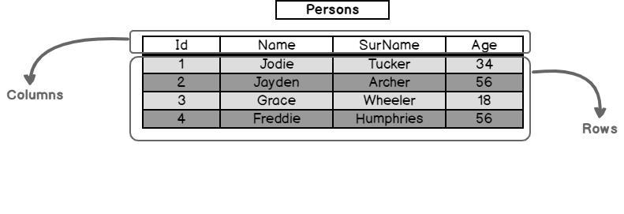

# Fundamentals of Databases
## SQL
Before we start with the explanations, shall we understand the meaning of these three letters?

**SQL = Structured Query Language**

SQL is considered structured because **it follows a specific syntax and standard in its commands.**

This facilitates learning and establishes a standard for how to query the database.

In other words, there is a structured way to solve a challenge.

If there is a problem or task, **users can use structured commands to solve it.**

And Query, well, basically we query everything in a database.

**SQL is not a programming language; it is a Structured Query Language**

#### Why should I learn SQL?

SQL is basically in the entire data ecosystem, from extracting relational bases, through transformation, to loading - you can deal with SQL in all these stages.

## Databases
A relational database **represents data in a structured manner, organized into tables composed of rows and columns.**

Each **table within the database contains data related to a specific entity or concept.**

- For example, in a company database, you might have tables for employees, departments, and projects.

The **columns within a table define the attributes or properties of the stored data.** Each column has a name and a data type, specifying the type of information that can be stored, such as integers, strings, dates, or binary data.

- For example, in an employee table, you might have columns for Employee ID, Name, Position, Department ID, and Hire Date.

**The rows, also known as records or tuples, represent individual instances of data within the table.** Each row contains a set of values corresponding to the columns defined in the table.

- Continuing with the example of an employee table, each row would represent a unique employee and contain specific information about that employee, such as their ID, name, position, etc.

One of the key features of a relational database is the establishment of relationships between tables. **These relationships define how data in one table is related to data in another.** The relationships are **generally established using keys, such as primary keys and foreign keys.**

- The primary key uniquely identifies each record in a table.
- The foreign key establishes a link between two tables, referencing the primary key of another table.

Overall, **the tabular structure of a relational database, along with the relationships between tables, provides a flexible and efficient way to organize and manage large volumes of data.**

This structure allows for easy querying, retrieval, and manipulation of data, making relational databases a popular choice.

***Databases -> Tables (Relationships) -> Columns -> Rows***
- 

## RDBMS vs. DBMS
**Relational Database Management System (RDBMS):**

An RDBMS is a specific type of DBMS that is **based on the relational data model.**

It organizes data into related tables, where relationships between data are established using keys.

The main features of an RDBMS include:

1. **Relational Model:** Data is organized into tables with rows and columns, following the relational model.

2. **Referential Integrity:** The RDBMS supports referential integrity, ensuring that relationships between tables are consistently maintained.

3. **ACID Operations:** Transactions in an RDBMS are ACID (Atomicity, Consistency, Isolation, and Durability), ensuring data reliability and consistency.

4. **SQL:** RDBMSs generally support SQL (Structured Query Language) as the standard query language to interact with the database.

**Examples:**
- Microsoft SQL Server
- Oracle Database
- PostgreSQL
- MySQL

**Database Management System (DBMS):**
Refers to any technology for managing databases, regardless of the underlying data model. This includes not only RDBMS but also other types of database management systems, such as document-oriented databases, time series databases, graph databases, etc.

## ACID Properties
ACID properties are a **set of characteristics that guarantee the reliability and consistency of data in relational database management systems.** The term ACID is an acronym formed by the first letters of the four properties that compose it: **Atomicity, Consistency, Isolation, and Durability.**

The **ACID** properties emerged when relational database management systems began to become popular, where they were mainly used for financial applications and other critical data applications. As a result, it was necessary to establish a set of standards that guaranteed data integrity.

The ACID properties were developed to meet this need, quickly becoming a standard for relational database systems. They were incorporated into many relational database management systems, including Oracle, MySQL, and PostgreSQL, to ensure data reliability and consistency in all critical data applications.

The ACID properties are as follows:
1. **Atomicity:** Either everything happens or nothing is considered... This means that all operations must be successfully executed, or, if a failure occurs in one operation, all operations must be rolled back to the previous state. This ensures that data always remains consistent.

2. **Consistency:** If it was okay before, it has to be okay afterwards too… This property ensures that the transition from one state to another must always maintain data integrity. This means that if a transaction violates the integrity rules defined in the database, the transaction will be rolled back to the previous state.

3. **Isolation:** If things happen in parallel ways, they need to be isolated… This property ensures that transactions are executed in isolation from each other, so that the execution of one transaction does not affect the result of another transaction being executed simultaneously. This ensures that the data remains consistent even when multiple transactions are being executed simultaneously.

4. **Durability:** Last as long as necessary… This property ensures that after a transaction is successfully completed, the modified data will remain persistent in the database, even in case of a system failure. This means that once changes have been made, they will be permanent and will not be lost due to system failures.

## T-SQL vs. PL/SQL vs. PL-PgSQL
Do you read a lot about T-SQL and PL/SQL in job descriptions?

These are dialects used to determine on which platform SQL will be applied...

For example:

- **Transact-SQL (T-SQL):** This version of SQL is used by Microsoft's SQL Server and Azure SQL services.

- **Procedural Language/SQL (PL/SQL):** This is used by Oracle.

It doesn't stop there. We have another example; PostgreSQL also has its own:

- **Procedural Language - Postgree/SQL (PL-PgSQL):** Extensions implemented in PostgreSQL.

In the end, the logic is the same, but you may find some differences in their syntax!

## Main SQL Server Services
SQL Server, developed by Microsoft, is a widely used relational database management system. It offers a variety of services to efficiently manage, store, and manipulate data. Here are some of the main SQL Server services:
- Database Engine;
- Data Quality Services;
- Analysis Services;
- Integration Services;
- Reporting Services;
- Master Data Services.

**Overview of services:**
1. **Database Engine (DE):** A D.E is the core component of SQL Server and is responsible for storing, managing, and retrieving data. It is underlying software that a DBMS (Database Management System) uses to create, read, update, and delete.

2. **Data Quality Services (DQS):** It is a knowledge-driven data quality product. It is an integrated service in SQL Server that offers advanced capabilities to improve and ensure data quality in a database environment. The idea is that you design a knowledge base and use it to solve data quality issues such as errors, inconsistencies, duplicates, and incomplete or inaccurate data.

3. **Analysis Services (SSAS):** Used for supporting databases for analytical purposes, used in decision support and business analysis. It enables the creation of advanced analytical models that can be used by these tools to offer insights and interactive visualizations to end users, with its focus on performance. Analysis Services technology helps build structures known as cubes, which allow for pre-calculation and storage of complex aggregations. These cubes are used to manage and transform large volumes of data into essential sets of summarized information. This provides more efficient and faster data analysis, allowing users to gain valuable insights more quickly. By pre-calculating aggregations, cube queries can be answered more quickly, resulting in improved performance for data analysis.

4. **Integration Services (SSIS):** Its focus is on executing a wide variety of data migration tasks. The famous E.T.L (Extract-Transform-Load). It is designed to help in the integration of data from various sources, transform it according to business needs, and load it into appropriate destinations such as databases, data warehouses, or analytics systems.

5. **Reporting Services (SSRS):** It is a service that provides capabilities for creating, publishing, and delivering interactive and paginated reports. It allows users to create reports based on data from various sources such as relational databases, analytical cubes, web services, and data files.

6. **Master Data Services (MDS):** Offers capabilities for centralized master data management. It is designed to help organizations control and maintain the consistency of master data throughout the enterprise, ensuring that essential information is up-to-date, accurate, and reliable.

Certainly, there are other specific services in SQL Server that play important roles, such as SQL Server Agent and SQL...
