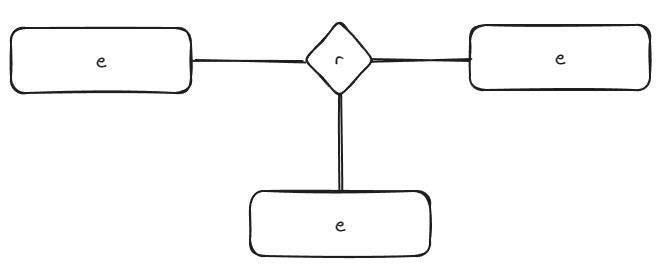
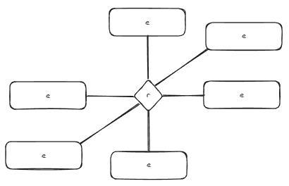
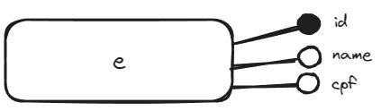
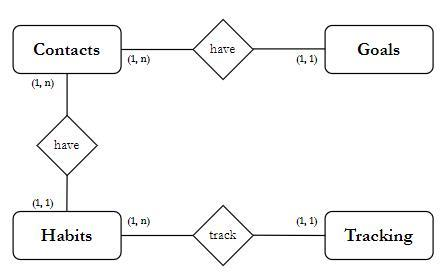
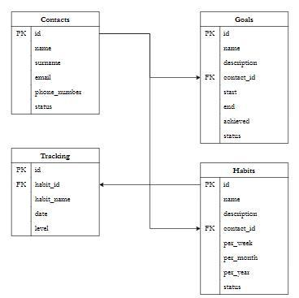
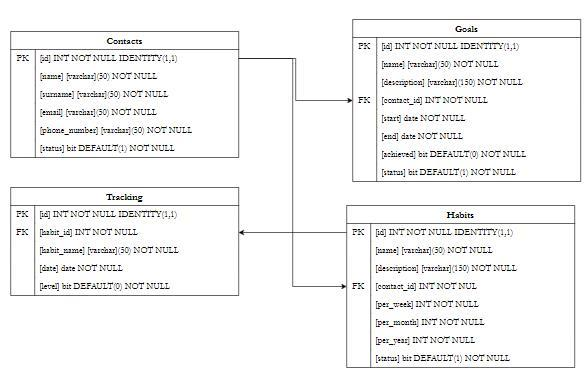

# A Guide to Data Modeling
Those who know me know that I love drawing and following processes — I truly believe this is the core for solving any problem.

Having good documentation and a well-defined process will make you much more confident when applying and creating something.

And one of the processes I love the most is **Data Modeling**. Seriously, it’s the kind of work I do while listening to music because it’s so enjoyable.

And what exactly does the modeling process consist of?

### We can mention:
1. Requirements Analysis
2. Conceptual Model (ERD - ERM)
3. Logical Model (Tables and Relationships)
4. Physical Model (Creating the tables in the database)

These will be the topics of this chapter, and at the end, I want to build a real example with you, from scratch.


## Requirements Analysis
Requirements analysis is the initial and fundamental phase in the data modeling process. It’s the advice we see the most on our dear LinkedIn -> **communication, my friends!**

This stage involves understanding and documenting user and system needs, identifying relevant data, and defining both functional and non-functional requirements for the system.

It’s crucial to ensure that the data model is built to meet the stakeholders' expectations and needs.

**Steps to analyze requirements:**
1. **Understanding the problem:** Detailed understanding of the system context, its objectives, and constraints.

2. **Requirements gathering:** Collecting information about the requirements.

3. **Analysis and documentation:** Analyzing the gathered requirements to identify inconsistencies and thoroughly documenting them.

4. **Requirements validation:** This step strongly connects with the next phase, as when we start creating relationships and diagrams, we often realize that some requirements are missing.

The idea here is active stakeholder participation to ensure that business needs are properly captured and translated into data requirements.

They don't need to know what type the [name] field will be, but it’s important to confirm with them whether the [name] field is truly necessary.


## Conceptual Model (ERD - ERM)
It is created through diagrams such as the **ERD (Entity-Relationship Diagram) or the ERM (Entity-Relationship Model).**

These diagrams **help visualize entities, their attributes, and the relationships between them in an abstract way, without considering implementation details.**

To better understand the purpose of a conceptual model, let’s first look at some important points:
- Entities
- Relationships
- Cardinalities
- Attributes

### Entities
Anyone who has programmed before knows that an **entity** is a **real-world object**. To simplify even more, it’s our **table**.

Entities can be **abstract** or **complete**:
- *An **abstract entity** is a general concept, without specifically defined characteristics.*
- *A **complete entity**, on the other hand, is a specific instance of an abstract entity, with distinct and well-defined characteristics.*

Entities are represented by rectangular shapes:
- 

There are two types of entities: **strong** and **weak**:

- **Strong:** Does not depend on the existence of another entity.

- **Weak:** Depends on a parent entity. These are represented with double rectangles.
    - 

### Relationships
They are basically **how entities talk and relate to each other.**
- 

The types of relationships are:

**1. Binary Relationship:** Two entities participate in a relationship.
- 

**2. Ternary Relationship:** Three entities participate in a relationship.
- 

**3. N-ary Relationship:** Four or more entities participate in a relationship.
- 

And it's within these relationships that we define **cardinalities.**

### Cardinality
Cardinality refers to the **number of occurrences of one entity related to another entity through a relationship.**

There are two main types of cardinality:
- **Minimum Cardinality:** Indicates the minimum number of entity occurrences that must be related to another entity.

- **Maximum Cardinality:** Indicates the maximum number of entity occurrences that can be related to another entity.

**Cardinality Notations:**
- **(0,1):** Zero or one occurrence.
- **(1,1):** Exactly one occurrence.
- **(0,N):** Zero or more occurrences.
- **(1,N):** One or more occurrences.

Since this stage can be confusing, here are some examples:
- **1,1 (One to One):** A customer has exactly one address, and an address belongs to only one customer.

- **1,N (One to Many):** A department can have many employees, but an employee belongs to only one department.

- **N,M (Many to Many):** A student can enroll in many courses, and a course can have many students enrolled. This is usually modeled using a junction table.

***Fun fact:** I learned about cardinality in the first semester of college and only actually used it nearly a year after I graduated.*


### Attributes
Attributes are simply the **characteristics of an entity**, meaning **its fields**.

They are represented as extensions to rectangles:
- 

The types of attributes are:

- **Atomic:** Single and indivisible.
    - Examples: CPF, CNPJ

- **Composite:** Can be divided into smaller parts.
    - Examples: Address, Name

- **Multivalued:** Can have multiple values associated.
    - Examples: Phone numbers

- **Derived:** Depends on another attribute or entity.
    - Examples: Age -> Birthdate

- **Key:** Used as an identifier.
    - Examples: PKs and FKs

With these concepts, we can create our **conceptual model**, which is a **high-level representation of the entities and their relationships within a business domain.**

Our database will be for **habit tracking**, and I left the conceptual model without specifying attributes. Only the **entities, relationships, and cardinality** are shown.
- 


## Logical Model (Tables and Relationships)
The Logical Model is a **more detailed representation of the database, translating the conceptual model into terms closer to physical implementation.** Logical modeling **does not include indexes or constraints**, only the **representation of tables and their relationships.**

It describes the tables, their attributes, and the relationships between them in a more concrete way, using data modeling languages like the Relational Model.

At this stage, **the entities from the ERD/ERM are mapped to tables, attributes are mapped to columns, and relationships are mapped to foreign keys.**

The logical model serves as the foundation for database implementation and is used for designing queries and transactions.

- 

## Physical Model (Creating the Tables in the Database)
The Physical Model is the **concrete implementation of the database, involving the actual creation of tables and other objects in the database as defined in the logical model.**

It describes how the data will be physically stored and accessed in the database, **including details such as data types, indexes, integrity constraints, and partitions.**

The physical model is specific to the chosen database management system (DBMS) and is often created using **SQL (Structured Query Language)** or database modeling tools.

At this stage, we also create documentation like a data dictionary and add our schemas to a repository.

This takes your project to a whole new level!

Example of a physical model diagram:
- 

Another way to represent this physical model is with **SQL scripts for table creation**. Examples:
```sql
CREATE TABLE [contacts] (
    [id] INT NOT NULL IDENTITY(1,1) PRIMARY KEY,
      NOT NULL,
      NOT NULL,
      NOT NULL,
      NOT NULL,
    [status] bit DEFAULT(1) NOT NULL
)

CREATE TABLE [goals] (
    [id] INT NOT NULL IDENTITY(1,1) PRIMARY KEY,
      NOT NULL,
      NOT NULL,
    [contact_id] INT NOT NULL,
    [start] date NOT NULL,
    [end] date NOT NULL,
    [achieved] bit DEFAULT(0) NOT NULL,
    [status] bit DEFAULT(1) NOT NULL,
    CONSTRAINT FK_goals_contacts FOREIGN KEY (contact_id) REFERENCES contacts(id)
)

CREATE TABLE [habits] (
    [id] INT NOT NULL IDENTITY(1,1) PRIMARY KEY,
      NOT NULL,
      NOT NULL,
    [contact_id] INT NOT NULL,
    [per_week] INT NOT NULL,
    [per_month] INT NOT NULL,
    [per_year] INT NOT NULL,
    [status] bit DEFAULT(1) NOT NULL,
    CONSTRAINT FK_habits_contacts FOREIGN KEY (contact_id) REFERENCES contacts(id)
)

CREATE TABLE [tracking] (
    [id] INT NOT NULL IDENTITY(1,1) PRIMARY KEY,
    [habit_id] INT NOT NULL,
    [date] date NOT NULL,
    [level] bit DEFAULT(0) NOT NULL,
    CONSTRAINT FK_tracking_habits FOREIGN KEY (habit_id) REFERENCES habits(id)
)
```
