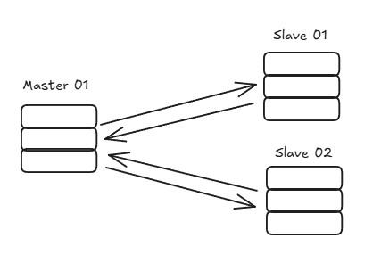
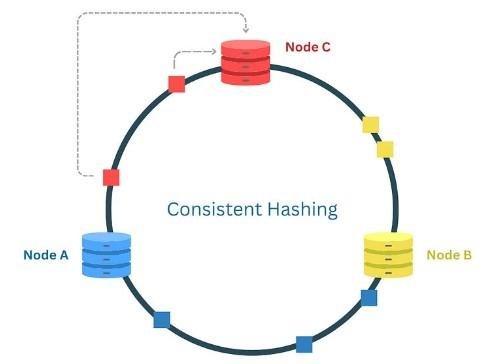
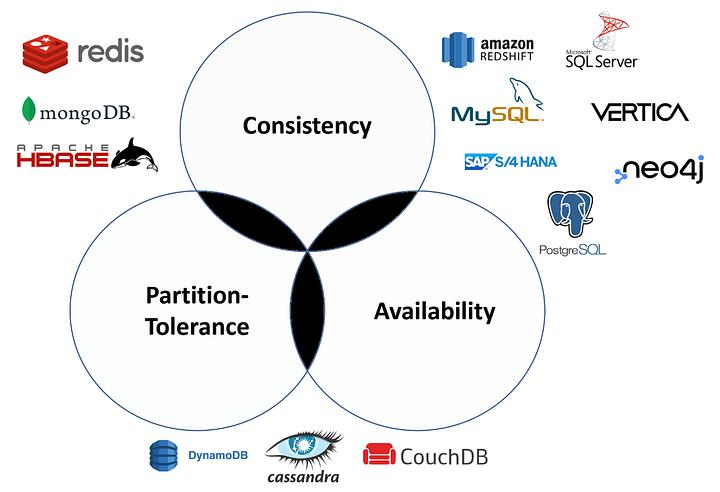

# A Guide to Database Patterns  

You probably already use and are familiar with some of the patterns I will present today. It's likely that you use most of them to help solve problems in your role.  

But if you've never used them, I hope this article can take the first step in applying good practices to your databases.  

I will explore these fundamental database patterns, which can help you solve common problems, such as improving query speed, managing large datasets, ensuring data availability, and maintaining consistency.  

Here are the topics we will cover:  
- **Indexing**  
- **Partitioning**  
- **Replication**  
- **Sharding**  
- **Consistent Hashing**  
- **ACID**  
- **CAP Theorem**  

## **Indexing**  
Let's start with what everyone wants when managing databases: fast queries!  

**Indexing** is a technique used in databases to speed up data retrieval more efficiently. The best example is a book's index: with it, you can quickly locate information by going straight to the point.  

An **index** in the database allows the search engine to locate rows more efficiently. With an index, the database does not need to scan the entire table.  
- **Without an index**, finding a topic means scanning all pages.  
- **With an index**, you can skip directly to the correct page.  

**Types of Indexes:**  
- **Single-column Index:** An index on a single column.  
```sql
CREATE INDEX idx_goal_name ON goals(goal_name);
```  

- **Composite Index:** An index on multiple columns.  
```sql
CREATE INDEX idx_name_type ON goals(goal_name, goal_type);
```  

- **Full-Text Index:** Used for text searches, optimizing searches in large text fields.  
```sql
CREATE FULLTEXT INDEX idx_text ON articles(content);
```  

- **Unique Index:** Ensures that all values in the indexed columns are unique.  
```sql
CREATE UNIQUE INDEX idx_unique_email ON users(email);
```  

### **Clustered Index vs. Non-Clustered Index**  

A **clustered index** determines the physical order of data in a table. Each table can have only one clustered index, and it is automatically created when a PRIMARY KEY is defined.  
```sql
CREATE TABLE goals (
    id INT PRIMARY KEY,  -- By default, this creates a clustered index
    name NVARCHAR(100),
    status INT
);
```  

A **non-clustered index** is a separate structure that maintains a pointer to the actual data in the table.  
```sql
CREATE NONCLUSTERED INDEX idx_goals ON goals(name);
```  
- The data remains physically ordered by `id` (clustered index).  
- The non-clustered index on `name` creates a separate structure with pointers to the actual rows in the table.  

The database engine decides which index to use based on performance calculations.  

If you want to learn more and how to apply it, check out this [post here!](https://medium.com/@lorenzouriel/everything-you-need-to-know-about-index-in-sql-server-b142787f1d98)  


## **Partitioning**  
Here’s another strategy that can improve your database performance.  

**Partitioning** is a technique that divides a large database into smaller chunks based on a range value. Imagine you cut your database into small pieces and define which information goes into each one.  

Several strategies can be applied here, such as:  
- **Range Partitioning:** Data is partitioned based on value ranges, being more efficient and easier to manage.  
  - Example: A transactions table is partitioned by `transaction_date`.  
- **Hash Partitioning:** Data is partitioned using a hash function or a key, such as IDs.  
  - Example: A transactions table is partitioned by `transaction_id` or a hash algorithm.  
- **List Partitioning:** Data is partitioned based on categories. Easy to manage but not recommended for very large tables.  
  - Example: A transactions table is partitioned by `transaction_country` or `transaction_bank`.  

**Partitioning** can be implemented in two ways:  
- **Horizontal Partitioning:** Divides a table into rows based on column values.  
- **Vertical Partitioning:** Divides a table based on columns, allowing less frequent data to be moved to "cold" storage.  

If you want to learn more and how to apply it, check out this [post here!](https://medium.com/@lorenzouriel/sql-server-partitioning-cold-warm-hot-part-1-2deaa8dae101)  


## **Replication**  
I love it when the name already explains exactly what the pattern is.  

**Replication** is the process of copying and replicating data from one database server to another. With replication, you can handle **fault tolerance**, keep the system always active, and improve performance. If one server goes down, you have another.  

When dealing with replication, we have two main types:  
- **Primary-Secondary (or Master-Slave):** The **primary (master)** handles all writes, and one or more **secondaries (slaves)** replicate data from the primary and handle read operations.  
- **Multi-Primary (or Multi-Master):** Multiple servers (masters) can handle reads and writes, synchronizing and replicating among themselves.  

Of course, there are challenges, such as maintaining consistency between replicas, especially in the second type. Some write operations may become slower due to replication overhead.  

I will make a future post just about this topic.  



## **Sharding**  
This is also a partitioning technique! Sounds confusing, right?  

Let's explain the difference between **sharding** and **partitioning**:  
- **Partitioning** means dividing a single large table into smaller parts called **partitions**, still within the same database instance.  
- **Sharding** is a form of **horizontal partitioning**. Data is distributed across multiple independent databases (shards).  

**Partitioning** occurs at the table level, within the same instance. **Sharding** occurs at the database level, distributing data across different instances.  

### How Sharding works:  
- Each **shard** contains a subset of the data, divided based on a **shard_key**.  
- The application determines which shard to query based on the same **shard_key**.  
- Shards can be distributed across different servers or locations.  

Some sharding strategies:  
- **Range Sharding:** Similar to **range partitioning**, data is divided into ranges.  
  - Example: Shard 1 → user_id 1-1000, Shard 2 → 1001-2000.  
- **Hash Sharding:** A hash function determines where data will be distributed.  
  - Example: `shard_id = hash(transaction_id) % total_shards`.  
  - If `hash(1001) % 3 = 2`, user 1001 goes to Shard 2.  
- **Geographical Sharding:** Data is distributed by location.  
  - Example: Shard 1 → Users from Brazil, Shard 2 → Users from Argentina.  
- **Directory Sharding:** A table stores the mapping of the **shard_key** to the correct shard.  
  - Example: `SELECT shard_id FROM shard_mapping WHERE transaction_id = 1001;`.  

## **Consistent Hashing**  
This is a technique for distributing data across multiple **nodes (servers)**. Its main advantage is that when nodes are added or removed, only a minimal amount of data needs to be redistributed.  

**Consistent hashing** works with a **hash ring**, a circular space. The hash function maps nodes and keys within this ring.  

- **Example:**  
  - Nodes `A`, `B`, `C` are at positions 10, 30, 50 on the ring.  
  - A key with hash 25 goes to Node B (30).  
  - A key with hash 45 goes to Node C (50).  
- **If a node is added or removed**, only nearby keys move:  
  - If Node B (30) is removed, its keys go to the next node (C).  
  - If Node D (40) is added, it only receives some keys from Node C (50).  

 

## **ACID**  
The **ACID** properties ensure transaction integrity in databases. They are especially critical in relational (SQL) databases.  

- **Atomicity (A) – "All or Nothing":** A transaction must be fully completed or fully reverted if any part fails.  
  - Example: Transfer R$100 from Ezio → Altair.  
    - If the money is debited from Ezio but **not** credited to Altair, the transaction fails and is reverted.  
    - If the system crashes after step (1) but before step (2), the transaction is undone, ensuring Ezio does not lose money without Altair receiving it.  

- **Consistency (C) – "Only Valid State":** A transaction must take the database from one valid state to another, following all rules.  
  - Example: A bank ensures that the total sum of accounts remains unchanged during a transfer.  
    - If an error causes R$100 to be debited from Ezio without being credited to Altair, the transaction is rejected.  

- **Isolation (I) – "No Dirty Reads":** Transactions should not interfere with each other. The final result should be the same as if they were executed sequentially.  
  - Example: Altair checks his balance while Ezio is transferring money to him.  
    - Without isolation, Altair could see an incomplete transaction (Ezio debited, but Altair not yet credited).  

- **Durability (D) – "Never Lost":** Once confirmed, a transaction must be stored permanently, even in case of failures.  
  - Example: You book a plane ticket and receive a confirmation email.  
    - Even if the server crashes right after, your reservation remains in the database and will be available when the system comes back.  

## **CAP Theorem**  
The **CAP Theorem** is simple to understand and complex at the same time.  

This theorem states that a distributed system can guarantee at most two of the three properties:  
- **Consistency (C) →** Every read receives the most recent write or an error.  
- **Availability (A) →** Every request receives a response (possibly outdated).  
- **Partition Tolerance (P) →** The system continues to function even with network failures.  

A distributed system **must tolerate network partitions (P)**, so it can only choose between **Consistency (C)** and **Availability (A)**.  

Imagine a database distributed across multiple servers. If a network failure occurs between two data centers:  
- If the system prioritizes **Consistency (C)**, some requests will fail to ensure the most recent data.  
- If the system prioritizes **Availability (A)**, it will return outdated data to ensure responses.  

You need to choose between **Consistency** or **Availability** when using SQL Server:  

