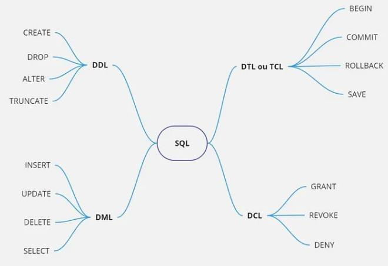

# A Guide to SQL Subsets

When working with SQL, if there is a problem or task at hand, users can use structured commands to resolve it.

A Query (Query), well, you know: basically, we query everything in a database.

SQL is not a programming language, it is a Query Language.

And that’s exactly where subsets come in; subsets are part of this Query Language.

They are separated into subsets precisely to identify what we are dealing with.
- 

For example, if we want to manipulate data, we use DML (Data Manipulation Language).

**Each subset works with a specific area of the database.**

Let's check out the subsets!

## Data Definition Language (DDL)
This is a subset of SQL that deals with defining or modifying the structure of a database schema.

DDL statements are used to create, modify, and delete database objects such as tables, indexes, views, and stored procedures.

**DDL Statements:**
1. **CREATE:** Used to create new database objects like tables, views, indexes, etc.
```sql
CREATE TABLE [sales] (
	[id] int IDENTITY (1,1) PRIMARY KEY, 
	[date] [date] NOT NULL,
	  NOT NULL
)
```

2. **ALTER:** Used to modify the structure of existing database objects.
```sql
ALTER TABLE [sales]
ADD COLUMN [value] [money] NULL
```

3. **DROP:** Used to delete existing database objects.
```sql
DROP TABLE [sales]
```

4. **TRUNCATE:** Used to remove all records from a table while keeping the table structure intact.
```sql
TRUNCATE TABLE [sales]
```

## Data Manipulation Language (DML)
This is a subset of SQL used to manipulate data stored in a database.

DML is focused on tasks like querying, inserting, updating, and deleting data within tables.

**DML Statements:**
1. **SELECT:** Retrieves data from one or more tables based on specific criteria.
```sql
SELECT * FROM [sales] WHERE [value] >= 800
```

2. **INSERT:** Used to add new rows of data to a table.
```sql
INSERT INTO [sales] (product, date, value) 
VALUES ('Laptop', '2024-04-21', 500);
```

3. **UPDATE:** Used to modify existing data within a table.
```sql
UPDATE [sales] 
SET [value] = 800
WHERE [product] = 'Laptop'
```

4. **DELETE:** Used to remove rows of data from a table based on specific conditions.
```sql
DELETE FROM [sales] 
WHERE [product] = 'Laptop'
```

There’s a lot of debate here, some say SELECT is part of DML, others say it’s part of DQL.

But after checking the Microsoft SQL Server documentation, boom: **SELECT is part of DML.**

DQL doesn't even exist in the documentation. If SQL is a query language by itself, why would DQL exist?

*Crazy, right?*

## Data Control Language (DCL)
These are essentially access controls, allowing you to grant or revoke access.

**DCL Statements:**

1. **GRANT:** Grants permissions to a user or role.
```sql
GRANT SELECT ON [sales] TO [user]
```

2. **REVOKE:** Revokes permissions granted by GRANT.
```sql
REVOKE SELECT ON [sales] TO [user]
```

3. **DENY:** Explicitly denies permissions to a user or role.
```sql
DENY DELETE ON [sales] TO [user]
```

## Data Transaction Language (DTL)
This is a subset of SQL used to manage transactions within a database.

In a relational database, almost everything is a transaction. These commands are mostly used in the context of explicit transactions—where the developer explicitly defines the structure of a transaction.

**DTL Statements:**
1. **BEGIN TRANSACTION:** Starts a new transaction. All subsequent SQL statements are part of this transaction until it is committed or rolled back.
```sql
BEGIN TRANSACTION;

UPDATE [sales] 
SET [value] = 800
WHERE [product] = 'Laptop'
```

2. **COMMIT TRANSACTION:** Saves all changes made during the current transaction to the database.
```sql
BEGIN TRANSACTION;

UPDATE [sales] 
SET [value] = 800
WHERE [product] = 'Laptop'

COMMIT TRANSACTION;
```

3. **ROLLBACK TRANSACTION:** Undoes all changes made during the current transaction.
```sql
BEGIN TRANSACTION;

UPDATE [sales] 
SET [value] = 800
WHERE [product] = 'Laptop'

ROLLBACK TRANSACTION;
```

4. **SAVE TRANSACTION:** Sets a savepoint within the transaction to which you can later roll back.
```sql
BEGIN TRANSACTION;

SAVE TRANSACTION MySavepoint;

UPDATE [sales] 
SET [value] = 800
WHERE [product] = 'Laptop'

ROLLBACK TRANSACTION MySavepoint;
```
