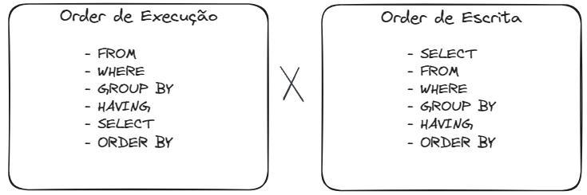

# A Guide to Understanding a SELECT

A `SELECT` command in SQL is used to retrieve data from one or more tables in a database.

It is powerful because it is accompanied by several clauses, with which you can specify exactly what data you want to retrieve and how you want to manipulate it.

## Basic Structure of a SELECT Command
The basic structure of a SELECT command in SQL is as follows:
```sql
SELECT 
    column1, 
    column2, ...
FROM table_name
WHERE condition
GROUP BY column
HAVING condition
ORDER BY column ASC|DESC;
```

### Meaning of Each Clause:

`SELECT`: Specifies which columns you want to retrieve. You can select specific columns using `column_name`, use aggregation functions (such as `SUM`, `COUNT`, `AVG`), and more.

`FROM`: Specifies the table or tables from which you want to retrieve data. You can include multiple tables using `JOIN` to combine data from different sources.

`WHERE`: Allows you to filter records based on specific conditions.

`GROUP BY`: Allows you to group the results based on one or more columns. It is commonly used in conjunction with aggregation functions.

`HAVING`: Allows you to filter groups of rows resulting from a `GROUP BY`, or better, filter aggregation groups. Similar to `WHERE`, but applied after `GROUP BY`.

`ORDER BY`: Sorts the results in ascending (`ASC`) or descending (`DESC`) order based on one or more columns.

## Examples of Using Clauses
**1. Selecting All Columns from a Table:**
```sql
SELECT 
	*
FROM sales
```

**2. Selecting Specific Columns and Applying Filters:**
```sql
SELECT 
	*
FROM products
WHERE product = 'Product A'
```

**3. Using Aggregation Functions with GROUP BY:**
```sql
SELECT 
	product_id,
	SUM(value) AS [Value]
FROM sales
GROUP BY product_id
```

**4. Applying Filters with HAVING After GROUP BY:**
```sql
SELECT 
	product,
	SUM(value) AS [Value],
	COUNT(*) AS [Quantity Sold]
FROM sales
GROUP BY product
HAVING COUNT(*) > 2000
```

**5. Sorting Results with ORDER BY:**
```sql
SELECT 
	product_id,
	date
FROM sales
ORDER BY product_id ASC, date DESC
```

### Writing Order vs Execution Order
It’s important to understand that your DBMS does not execute in the order you write. It has a predefined way of checking your query, and this order is used to create an optimized execution plan.
- 
