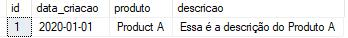
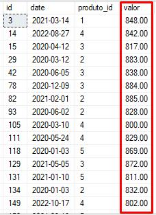

# A Guide to Wildcards  
**Wildcard characters** are special characters used in fuzzy data queries.  

They can substitute characters in searches, like a wildcard.  

The most common wildcards are:  
- `%` (percent)  
- `_` (underscore)  

Some examples:  

**1. Selects all rows where the product ends with "A":**  
```sql
SELECT 
    * 
FROM products 
WHERE product LIKE '%A%'
```
- `%` substitutes for zero or more characters  
- This query returns all records containing 'A' in the table  

**Result:**  
-   

**2. Selects all rows where value starts with "8" followed by 5 characters**  
```sql
SELECT 
    * 
FROM sales 
WHERE value LIKE '8_____'
```
- `_` substitutes exactly one character  
- This searches for values like 800.00 (8 followed by 5 characters)  

**Result:**  
- 
