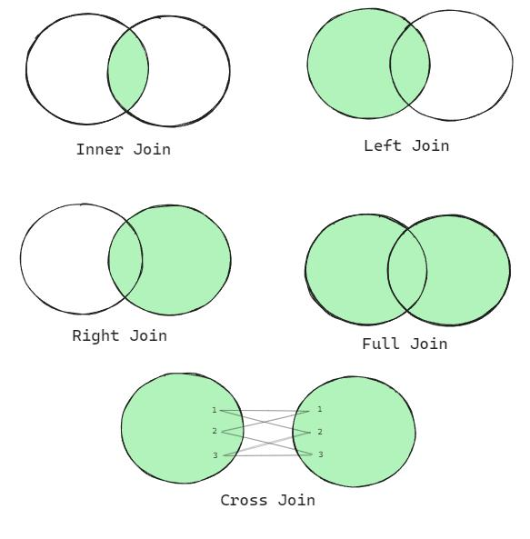
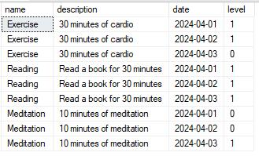
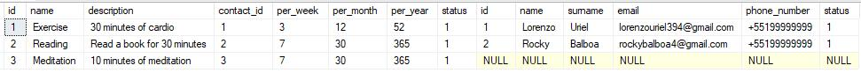
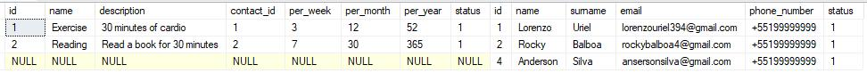
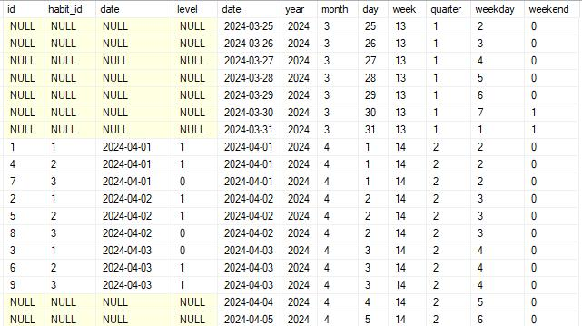
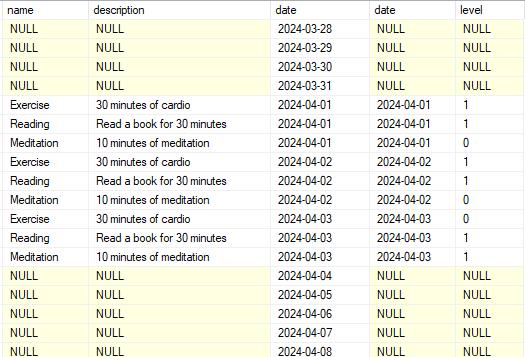
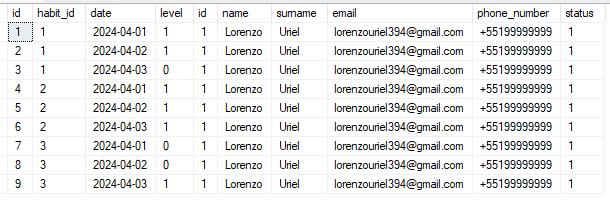
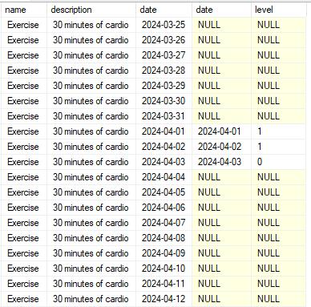
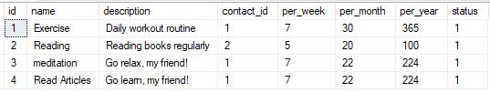
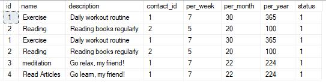

# A Guide to Joins
A join is an operation used to combine rows from two or more tables based on a related column between them. It does not necessarily need to be an ID with ID; it can be any field that has a relationship between the tables.

I want to highlight the main points among the existing joins and give examples of their uses:
- 

- *For these examples, we will use the database we created in the data modeling article*


## INNER JOIN
It retrieves records **from both tables where there is a match based on the specified condition.** If there is no matching record in either table, the rows will not appear in the result set.

An INNER JOIN is the most common type of join in SQL, I'm sure you’ve done it at least once.

It combines rows from two tables based on a related column between them, you need a field that exists in both tables.

The result set contains only the rows for which the join condition is true in both tables; if the `id` is orphaned, there is probably something wrong with your tables.

For **INNER JOIN you can simply write JOIN.**

**Example:**
```sql
SELECT 
	h.[name],
	h.[description],
	t.[date],
	t.[level]
FROM tracking t
INNER JOIN habits h ON (t.[habit_id] = h.[id])
-- JOIN habits h ON (t.[habit_id] = h.[id])
```

**Result:**
- 

In this example, **I am performing the join to identify the name and description of each habit practiced on the dates.**

## LEFT JOIN
LEFT JOIN is **useful when you want to retrieve all records from the left table, regardless of whether or not there is a matching record in the right table.**

If there is no match in the right table, NULL values are returned for the columns from the right table.

**Example:**
```sql
SELECT 
	*
FROM habits h
LEFT JOIN contacts c ON (h.[contact_id] = c.[id])
```

**Result:**
- 

We can see that the contact with `id` 03 does not exist in the `contacts` table, so the return related to this row will be NULL.

## RIGHT JOIN
It is similar to a LEFT JOIN, but **retrieves all records from the right table and the matching records from the left table.**

If there is no match in the left table, NULL values are returned for the columns from the left table.

RIGHT JOIN is **less commonly used than LEFT JOIN, but it can be useful in certain situations, especially when you want to focus on data from the right table.**

**Example:**
```sql
SELECT 
	*
FROM habits h
RIGHT JOIN contacts c ON (h.[contact_id] = c.[id])
```

**Result:**
- 

We can see that the contact with `id` 04 does not exist in the `contacts` table, and since it is not related to any habit, the returns from the `habits` table return as NULL.

## FULL JOIN 
It retrieves all records **when there is a match in the left or right table.**

If there is no match, **NULL values are returned for the columns from the table without a corresponding row.**

FULL JOIN is useful when you want to **retrieve all records from both tables and see where they match or not.**

**Example:**
```sql
SELECT 
	*
FROM tracking tr
FULL JOIN time t ON (tr.[date] = t.[date])
```

**Result:**
- 

Here I am creating a timeline with this data, **I can analyze all the days a habit was performed and the days it wasn’t.**

In this example, it will only duplicate the row where a habit occurred. If three habits were performed on the 2nd, then there will be three rows on the 2nd. This is a **FULL JOIN**, you will identify occurrences in both tables.

**Complete Example:**
```sql
SELECT 
	h.[name],
	h.[description],
	t.[date],
	tr.[date],
	tr.[level]
FROM [tracking] tr
FULL JOIN [time] t ON (tr.[date] = t.[date])
LEFT JOIN [habits] h ON (h.[id] = tr.[habit_id])
```

**Result:**
- 

A LEFT JOIN was performed to fetch the dimension fields and create a more complete query, connecting two dimensions to a fact. **We are analyzing the information from a timeline with descriptions from another dimension table.**

Can you get any insights yet?

## CROSS JOIN
It returns the Cartesian product of the two tables, **combining each row from the first table with each row from the second table.**

Unlike other joins, **it does not require any condition to be met.**

CROSS JOIN **generates a result set with the total number of rows equal to the number of rows in each table.**

It can be useful for **generating data combinations**, but it can also **result in large result sets.**

**Example:**
```sql
SELECT 
	*
FROM habits hr
CROSS JOIN contacts
```

**Result:**
- 

I will show a similar example to the one used in the FULL JOIN and we will identify their differences.

**Complete Example:**
```sql
SELECT 
	h.[name],
	h.[description],
	t.[date],
	tr.[date],
	tr.[level]
FROM [habits] h
CROSS JOIN [time] t
LEFT JOIN [tracking] tr ON (h.[id] = tr.[habit_id] and t.[date] = tr.[date])
```

**Result:**
- 

The difference between **CROSS** and **FULL** is that with **FULL**, we only duplicate the rows where occurrences exist. With **CROSS**, it crosses all rows from the `time` table with the `habits` table.

In other words, if there are 366 records in the `time` table and only 03 records in the `habits` table, SQL will return 1,098 records. In the case of **LEFT JOIN**, we use it with the same goal of identifying on which date the habit was performed.

## Which one to use more?
In fact, **INNER JOIN is the most used in SQL queries.**

Personally, **I tend to resort to LEFT and RIGHT JOINs when I am analyzing the tables I have, often to examine the presence or absence of values. Or, as shown in the examples above, sometimes we need a LEFT JOIN to fetch only the existing records without duplication.**

**FULL JOIN**, on the other hand, is reserved for scenarios like the one described above – **instances where we need to correlate with a timeline.** You can also use **it when analyzing data where some records may be missing in one data set but present in another, to ensure that no data is lost during the join operation.**

**CROSS JOIN** is useful **when you need to generate all possible data combinations**, such as when creating test data for a database or performing certain types of analysis. You may also **use it in scenarios where you need to compare each item from one set with each item from another set.**

It really depends on the need and your challenge!

## UNION vs. UNION ALL
Both **UNION** and **UNION ALL** are used to **combine results from two or more queries into a single result list.** However, they have important differences in their behavior:

- ***Note:** I created a table identical to my `habits` and added new records for comparison purposes.*

### UNION
It combines the results from two or more queries into a single result list.

**It automatically removes any duplicate records that might arise between queries.**

It is useful when you want to **combine results from multiple queries and ensure there are no duplicate records in the final results.**

The idea is to generate a unique result set.

**UNION Example:**
```sql
SELECT 
	*
FROM [tracking_habits].[dbo].[habits]

UNION

SELECT 
	*
FROM [tracking_habits].[dbo].[old_habits]
```

**Result:**
- 

### UNION ALL
It combines the **results from two or more queries into a single result list.**

However, unlike UNION, it does not remove duplicate records - **it simply combines all results, including duplicates if any.**

It is faster than UNION because it does not need to check and remove duplicates.

Use **UNION ALL** when you want to combine all results or when you are sure there will be no duplicate records and want to improve performance.

**UNION ALL Example:**
```sql
SELECT 
	*
FROM [tracking_habits].[dbo].[habits]

UNION ALL

SELECT 
	*
FROM [tracking_habits].[dbo].[old_habits]
```

**Result:**
- 