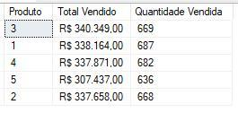

# A Guide to CTE (Common Table Expression)  
The idea of creating a CTE (Common Table Expression) is to maintain and manipulate a temporary result, similar to temporary tables that are deleted as soon as the query finishes.  

With a CTE, you can define a named and reusable query within another query. Widely used to improve code readability, you create it in blocks and manipulate these blocks through other queries. You will "break" a complex query into manageable blocks.  

- *You can create CTEs for all types of commands: `SELECT`, `INSERT`, `UPDATE`, or `DELETE`*  

**The standard syntax of a CTE:**  
```sql  
WITH cte AS (  
  SELECT  
    *  
  FROM table  
)  

SELECT  
  *  
FROM cte;  
```  

First, you start the CTE with the `WITH` clause, add the CTE name and the `AS` clause followed by parentheses. All the code written inside the parentheses is your CTE, the `SELECT` below is used to manipulate the result values of your query inside the `CTE`.  

It is important to remember that a CTE can only be queried within the scope in which it was created. That is, you cannot reference a CTE outside the query where it was defined.  

**The main advantages of using one are:**  
- **Code readability:** CTEs make SQL code more readable; whoever picks up the code after you will thank you.  
- **Logic reuse:** A CTE can be referenced multiple times in a query. Imagine you used the CTE to encapsulate a business rule and now want to manipulate that same rule.  
- **Debugging:** When the code breaks or needs maintenance, you can work in blocks, making debugging easier.  
- **Performance:** This is debatable, as there is a query optimizer in DBMSs. You can encapsulate this query in a CTE, and the DBMS will find an optimized execution plan—it's not a rule.  

**Let's talk about disadvantages:**  
- **Scope limitation:** This is the main disadvantage of a CTE; it is limited to the query in which it is defined. To expand this scope, we will need to use Views, Procedures, Functions, etc.  

## Creating Our CTE  
- *I will use the same sales database from the functions chapter.*  

I want to create a CTE to filter sales made on a specific date. I will break this reasoning into parts:  

**1. Define the initial query:**  
```sql  
SELECT   
	id,  
	date,  
	product_id,  
	value  
FROM sales   
WHERE product_id = 2  
```  
- I perform the main query limited to one product in the `WHERE`.  

**2. Encapsulate the SELECT in a CTE:**  
```sql  
WITH sales_by_product AS (  
	SELECT   
		id,  
		date,  
		product_id,  
		value  
	FROM sales   
	WHERE product_id = 2  
)  
```  
- Here, I encapsulated my main query in a CTE.  

**3. Querying my CTE:**  
```sql  
WITH sales_by_product AS (  
	SELECT   
		id,  
		date,  
		product_id,  
		value  
	FROM sales   
	WHERE product_id = 2  
)  
SELECT   
	*  
FROM sales_by_product  
```  
- You just need to add a `SELECT` however you want below.  
- Here, you can create various analyses related to your CTE, as if your CTE had become a table.  

### Breaking Down a CTE  
For this example, we will use the following CTE:  
```sql  
WITH sales_2021 AS (  
	SELECT   
		id,  
		YEAR(date) [year],  
		product_id,  
		value  
	FROM sales   
	WHERE YEAR(date) = '2021'  
)  
SELECT   
    product_id [Product],  
	FORMAT(SUM(value), 'C', 'pt-BR') [Total Sold],  
	COUNT(*) [Quantity Sold]  
FROM sales_2021  
GROUP BY product_id  
```  

**Let's understand this CTE together:**  
- The CTE is defined at the beginning of the SQL statement using the `WITH` clause.  
- The CTE name is `sales_2021`.  
- Inside the CTE, we have a query to select specific data from the `sales` table.  
    - We select the fields `id`, `YEAR(date) AS year`, `product_id`, and `value` from the `sales` table.  
    - The filter `WHERE YEAR(date) = 2021` is applied to select only sales from the year 2021.  
- After defining the CTE, a query is executed.  
    - We select the fields `product_id`, `FORMAT(SUM(value), 'C', 'pt-BR') AS [Total Sold]`, and `COUNT(*) AS [Quantity Sold]`.  
    - In the `value` field, I use the `SUM()` function to sum the total and `FORMAT` to format it in the desired currency, in this case, Brazilian Reais (R$).  
    - We use the CTE `sales_2021` in the `FROM` clause to access the filtered data of sales from the year 2021.  
    - We group the results by the `product_id` field using `GROUP BY product_id`.  

**And this is the query result:**  
-   

I hope this chapter has helped you understand the much-feared CTE. If you want to add good readability to your code, don't be afraid to use it.  