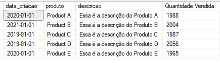
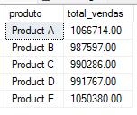
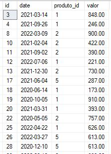
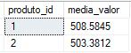
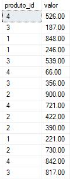

# A Guide to Subqueries  
A subquery, as the name itself says, is a sub-query. It means it is a query inside another query, or rather, a `SELECT` inside another `SELECT`.  

I personally love using subqueries, they help a lot and have various ways of use.  

You will use it to fetch a result set that will be used in the main query, you can create this set in various clauses, such as: `SELECT`, `FROM`, `WHERE`, `HAVING`, `IN`, `EXISTS`—it will depend on the need.  

**Identifying a subquery:**  

When you find a `SELECT` inside another `SELECT`, it means you are dealing with a subquery.  
```sql  
SELECT  
    *  
FROM sales  
WHERE product_id IN (SELECT product_id FROM products)  
```  
- *I will add the data insertion script for the `products` table below.*  

## Examples of Subqueries  
Earlier, I mentioned that we can use subqueries in various clauses, the idea now is to show you examples of each one.  

### Subquery in the SELECT Clause  
I want to get the quantity of sales per product, I will query the `sales` table as a subquery.  
```sql  
SELECT  
	p.creation_date,  
	p.product,  
	p.description,  
	(SELECT COUNT(*) FROM sales v WHERE p.id = v.product_id) [Quantity Sold]  
FROM products p  
```  
- In cases like this, it is common to perform a `JOIN` between the tables and work with the results in the main query.  
- In this example, I establish the relationship in `WHERE p.id = v.product_id`, fetching the quantity sold for each product.  

**Result:**  
-   

### Subquery in the FROM Clause  
We can use a subquery to create a virtual table that will be used as a data source for the main query, applying the filter directly on the virtual table.  

This model is very similar to CTE, we encapsulate the logic in the `FROM`.  
```sql  
SELECT  
	p.product,  
	SUM(v.value) AS total_sales  
FROM (  
    SELECT  
		id,  
		product,  
		creation_date  
    FROM products  
    WHERE creation_date > '2018-01-01'  
) AS p  
INNER JOIN sales v ON p.id = v.product_id  
GROUP BY p.product  
```  
- In my experience, this is the most used one, you can add different levels of `SELECT` to manipulate the main query.  

**Result:**  
-   

### Subquery in the WHERE and IN Clause  
We can use a subquery to filter results based on conditions from another table.  
```sql  
SELECT  
	id,  
	date,  
	product_id,  
	value  
FROM sales  
WHERE product_id IN (SELECT id FROM products WHERE creation_date > '2019-01-01')  
```  
- In this example, I select all sales of products that were created after a certain date.  

**Result:**  
-   

### Subquery in the HAVING Clause  
Let's use a subquery in the `HAVING` clause to filter groups after aggregation.  
```sql  
SELECT  
	product_id,  
	AVG(value) AS average_value  
FROM sales  
GROUP BY product_id  
HAVING AVG(value) > (  
    SELECT AVG(value) FROM sales  
)  
```  
- Here, I filter products that have sales with an average value above a certain limit, I fetch the average and then filter only the products whose average value is higher than the overall sales average.  

**Result:**  
-   

### Subquery in the EXISTS Clause  
The idea is to check the existence of records that satisfy a specific condition, very similar to the use in `IN`.  
```sql  
SELECT  
    product_id,  
    value  
FROM sales v  
WHERE EXISTS (  
    SELECT  
		product  
    FROM products p  
    WHERE p.id = v.product_id  
)  
```  
- I fetch only the sales of products that EXIST `EXISTS` in the `products` table.  

**Result:**  
-   

I hope this chapter has helped you understand what subqueries are and the ways to use them, I recommend understanding the need of your code before using them.  

## Database Used  
Script used to create the `products` table and insert the products.  
```sql  
CREATE TABLE products  
(  
    [id] [int] NOT NULL IDENTITY(1,1) PRIMARY KEY,  
	[creation_date] [date] not null,  
	[product] [varchar](50) not null,  
	[description] [varchar](100) not null  
)  

INSERT INTO products  
VALUES  
('2020-01-01', 'Product A', 'This is the description of Product A'),  
('2021-01-01', 'Product B', 'This is the description of Product B'),  
('2019-01-01', 'Product C', 'This is the description of Product C'),  
('2019-01-01', 'Product D', 'This is the description of Product D'),  
('2020-01-01', 'Product E', 'This is the description of Product E')  
```  
