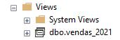
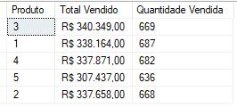
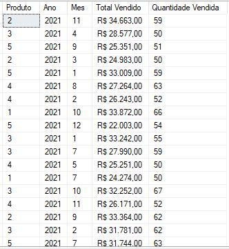

# A Guide to Views  
The most correct definition of a view is that it represents a stored query in your database.  

Remember the CTE or Subqueries module, using them we can encapsulate a main query and then manipulate it through other queries. The view works with the same concept, the difference is that you can store and manipulate these queries as if they were tables. It is not limited only to the scope in which it was created, unlike CTEs and Subqueries.  

"But can we mix the two?"  

Yes, you can create a view with subqueries and CTEs, one concept does not limit the other, it depends a lot on your need.  

**The main benefits of having a view are:**  
- **You can store a query definition:** You don’t need to keep sharing your `SELECT` with devs or users, you just share the view. From this view, they can perform the queries.  
- **Access restriction and more security:** No more giving table access to collaborators. Your job now is to understand the need, create a query, add it to a view, and make the view available to those who want to query it.  
- **Having a defined execution plan:** When the user runs various types of `SELECT` in your database, they make your DBMS create multiple execution plans for the queries. If you provide a view, the DBMS will have an optimized execution plan for the query in question.  

**Creation syntax:**  
```sql  
CREATE VIEW view_name  
AS  
SELECT  
    column1,  
    column2,  
    ...  
FROM table  
WHERE condition  
```  

## Creating a VIEW Using Our CTE  
For this example, we will use the CTE we created in the CTE chapter:  
```sql  
WITH sales_2021 AS (  
	SELECT  
		id,  
		YEAR(date) [year],  
		product_id,  
		value  
	FROM sales  
	WHERE YEAR(date) = '2021'  
)  
SELECT  
    product_id [Product],  
	FORMAT(SUM(value), 'C', 'pt-BR') [Total Sold],  
	COUNT(*) [Quantity Sold]  
FROM sales_2021  
GROUP BY product_id  
```  

Let’s add all this code under a simple command: `CREATE VIEW sales_2021 AS`.  
```sql  
CREATE VIEW sales_2021  
AS  
	WITH sales_2021 AS (  
		SELECT  
			id,  
			YEAR(date) [year],  
			product_id,  
			value  
		FROM sales  
		WHERE YEAR(date) = '2021'  
	)  
	SELECT  
		product_id [Product],  
		FORMAT(SUM(value), 'C', 'pt-BR') [Total Sold],  
		COUNT(*) [Quantity Sold]  
	FROM sales_2021  
	GROUP BY product_id  
```  

Great if the return was `Commands completed successfully.` Congratulations, you have a view in your database.  
-   

Now, I imagine you want to query this view, it’s simpler than it seems, you will literally run a `SELECT * FROM view`.  
```sql  
SELECT  
	*  
FROM sales_2021  
```  
**Result:**  
-   

Amazing, right?  

The best part is that it always updates as new data is inserted into the main tables.  

Instead of taking a huge query to your Dashboard, consolidate it into a view. It will be much simpler for those who will work with this query.  

## Updating and Removing Views  
If you remember the Subsets module, you will remember the `ALTER` and `DROP` commands, they apply to any manipulation of objects created in SQL.  

Just as you use `CREATE` to create, you use `ALTER` to modify and `DROP` to delete.  

**`ALTER VIEW`:**  
```sql  
ALTER VIEW sales_2021  
AS  
	WITH sales_2021 AS (  
		SELECT  
			id,  
			YEAR(date) [Year],  
			MONTH(date) [Month],  
			product,  
			value  
		FROM sales  
		WHERE YEAR(date) = '2021'  
	)  
	SELECT  
		product [Product],  
		Year,  
		Month,  
		FORMAT(SUM(value), 'C', 'pt-BR') [Total Sold],  
		COUNT(*) [Quantity Sold]  
	FROM sales_2021  
	GROUP BY product, Year, Month  
```  
The CEO wants to analyze monthly sales of each product, I just added `MONTH(date) [Month]` and included `Year` and `Month` in the `SELECT`.  

**Result:**  
-   

**`DROP VIEW`:**  
```sql  
DROP VIEW sales_2021  
```  
Here there’s not much to say, you ran `DROP` and the return was `Commands completed successfully.` This view no longer exists in your database.  

I hope it’s clear now the usability and benefits of a view, I particularly like to use it a lot for access control and creating reports/dashboards.  