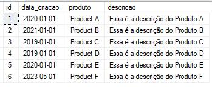
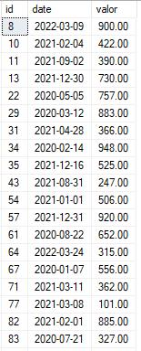

# A Guide to Stored Procedures  
Stored Procedures is the translation of this concept. They are sets of SQL instructions stored in your database that can be executed frequently.  

You'll also use them to encapsulate business logic, but in a more complex way. In a Stored Procedure, you can encapsulate insertion rules (`INSERT`), update rules (`UPDATE`), deletion rules (`DELETE`), and various other concepts. For `SELECT`, it's often used with parameters - you can define parameters in the query, something that can also be done with table-valued functions.  

I recommend focusing your efforts on manipulating more complex logic that is performed repeatedly.  

The main difference between a procedure and a function is that you execute a procedure using `EXEC`, unlike a function which you call through a `SELECT`.  

I mention this because this is exactly the context in which they should be used. Many end up getting confused and creating Procedures to store tables - not that this is wrong, but there are specific options for handling this.  

**The main benefits of creating a Stored Procedure are:**  
- **Performance and pre-compilation:** I make a point of listing this first. Stored procedures are pre-compiled and optimized by SQL Server.  
- **Always security:** You can restrict access to data and tables, prevent writing an `INSERT INTO` with errors, and include value validators.  
- **Maintenance:** They centralize business logic in the database, facilitating centralized maintenance.  

**Creation syntax:**  
```sql  
CREATE PROCEDURE procedure_name  
    @parameter1 int,  
    @parameter2 VARCHAR(50)  
AS  
BEGIN  
    INSERT INTO table (id, description)  
    VALUES (@parameter1, @parameter2)  
END  
```  

**Execution syntax:**  
```sql  
EXEC procedure_name 1, 'New product description'  
```  

## Creating a Stored Procedure to Insert a New Product  
```sql  
CREATE PROCEDURE insert_product  
    @product VARCHAR(50),  
    @description VARCHAR(100),  
    @creation_date DATE  
AS  
BEGIN  
    INSERT INTO products (product, description, creation_date)  
    VALUES (@product, @description, @creation_date);  
END  
```  
To insert, just execute `EXEC` passing the parameters: `@product VARCHAR(50)`, `@description VARCHAR(100)`, and `@creation_date DATE`  
```sql  
EXEC insert_product 'Product F', 'This is the description of Product F', '2023-05-01';  
```  

If we query the `products` table we'll see `Product F` added:  
-   

You can improve and use your procedure in several ways like:  
- Adding a date validator;  
- Creating a Trigger using this procedure;  
- Adding the procedure to an ETL Job or pipeline step;  
- Returning custom errors to the user: `TRY`, `CATCH`;  
- Creating transactions within the procedure scope: `TRANSACTION`, `COMMIT`, `ROLLBACK`.  

You can avoid many headaches by encapsulating this logic.  

## Creating a Stored Procedure to Get Sales by Product  
As I mentioned, you can create a procedure that returns a query result, with the key differentiator being that you can send parameters.  
```sql  
CREATE PROCEDURE sales_by_product  
    @product_id int  
AS  
BEGIN  
    SELECT id, date, value  
    FROM sales  
    WHERE product_id = @product_id  
END  
```  

To return the query you execute `EXEC` the same way:  
```sql  
EXEC sales_by_product 2  
```  
- *2 is the product_id we sent to the query as a parameter.*  

**Result:**  
-   

You might be wondering: *"Which should I use now? Views, Functions, or Procedures?"*  

**Comparison with Views and Table-Valued Functions:**  
- **Views:** Views are queries that can be reused as if they were virtual tables. The key difference is they don't accept parameters in their logic.  
- **Table-Valued Functions:** These return a table as a result and can accept parameters. Stored procedures are more used for executing complex business logic, while table-valued functions are more efficient for calculations or manipulations that return a result set.  

## Creating a Stored Procedure with Return Value  
This is widely used in pipelines and ETL jobs. Often we need a value from the database to populate a variable in our pipeline - in these cases we can use a procedure.  
```sql  
CREATE PROCEDURE count_products_sold_today  
AS  
BEGIN  
    DECLARE  
        @count INT  
    SELECT  
        @count = COUNT(*)  
    FROM sales  
    WHERE date = GETDATE()  
    RETURN @count  
END  
```  
Then just execute `EXEC` and check the return value, either using `SELECT` (which returns a column) or `PRINT` (which prints the value on screen):  
```sql  
DECLARE @total INT  
EXEC @total = count_products_sold_today  
SELECT @total [Total]  
PRINT @total  
```  

## Updating and Removing Procedures  
To alter a stored procedure, you can use the `ALTER PROCEDURE` statement:  
```sql  
ALTER PROCEDURE count_products_sold_today  
AS  
BEGIN  
    DECLARE  
        @count INT  
    SELECT  
        @count = COUNT(*)  
    FROM sales  
    RETURN @count  
END  
```  

To delete a stored procedure, you can use the `DROP PROCEDURE` statement:  
```sql  
DROP PROCEDURE count_products_sold_today  
```  

I advise focusing your efforts on creating business logic with validators: adding `TRY`, `CATCH` to handle exceptions, using transactions `TRANSACTION`, `COMMIT`, `ROLLBACK`, and defining clear, closed scope for business logic.