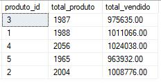
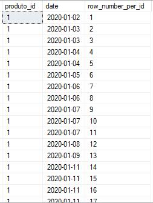
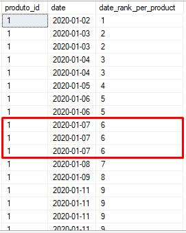
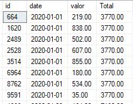
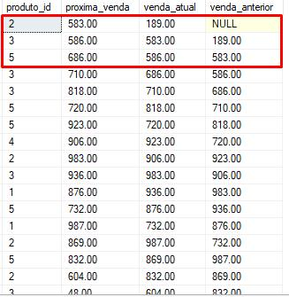

# A Guide to Functions  

SQL has many functions, and most of the time you will use the same ones—there are some main ones. The problem is that sometimes we limit ourselves to existing functions because we don’t know which others we can use.  

The idea here is to cover everything about functions. In some cases, I will only give examples of the main ones. But I want you to have an idea of how many functions SQL has.  

**But what is a function?**  
They are reusable blocks of code that can accept input parameters, perform specific operations, and return a value. With a function, you can encapsulate logic and apply it to different datasets with different parameters.  

There are two main types of functions in SQL: **user-defined functions (UDF)** and **built-in system functions.**  
- **User-Defined Functions (UDF)** are created by the developer and can be used in SQL queries to perform specific operations.  
- **Built-in system functions** can be used to perform common operations, such as string manipulation, dates, math, data type conversion, among others. Some examples include `CONVERT`, `DATEADD`, `LEN`, `LOWER`, `UPPER`, `GETDATE`, among others.  

In short, you will use a UDF when you need a more complex function that encapsulates a business rule. System functions are used for daily data manipulation routines, functions already configured in your SQL.  

## System Functions  
SQL Server comes with many pre-configured and created system functions. Before trying to create any function, I recommend checking the documentation to see if a function already exists that does the job you want.  

Below is a list of all categories of system functions:  

- **Aggregate Functions:** These functions are used to perform calculations on datasets, returning a single aggregated value. Examples include `SUM` (sum), `AVG` (average), `COUNT` (row count), `MIN` (minimum value), and `MAX` (maximum value).  

- **Configuration Functions:** These functions are used to configure and obtain information about SQL Server configuration, such as `@@VERSION` to get the SQL Server version, `@@MAX_CONNECTIONS` to get the maximum number of allowed connections, and `@@LANGUAGE` to get the current language configured on the SQL server.  

- **Cursor Functions:** Cursor functions in SQL Server allow traversing records row by row in a result set. They are used in conjunction with cursor declaration and manipulation in SQL. Some examples are `@@CURSOR_ROWS`, which returns the number of rows in the current cursor, and `@@FETCH_STATUS`, which returns the status of the last FETCH operation performed on the cursor.  

- **Date and Time Functions:** These are operations related to dates and times, such as formatting, adding or subtracting time intervals, obtaining specific parts of a date/time (day, month, year, etc.). Examples are `DATEADD`, `DATEDIFF`, `GETDATE`, `DATEPART`.  

- **Mathematical Functions:** These include mathematical functions to perform operations such as rounding, truncation, exponentiation, logarithm, square root, among others. Examples are `ROUND`, `CEILING`, `FLOOR`, `POWER`.  

- **Metadata Functions:** These functions provide information about the database schema, tables, columns, and objects. Examples include `OBJECT_ID`, `OBJECT_NAME`, `COLUMNPROPERTY`.  

- **Other Functions:** This category generally includes other useful functions that do not fit into the main categories, such as XML data manipulation functions, functions related to spatial operations, functions for handling null values, and some conversion functions.  

- **Hierarchy Id Functions:** These are specific functions for working with stored hierarchical data. Some functions are: `GetRoot()`, `GetLevel()`, `GetDescendant()`, etc.  

- **Rowset Functions:** These are functions that return sets of rows of data. For example, `OPENROWSET()` allows accessing data from external sources (such as CSV files) as if they were tables within a SQL query, `OPENQUERY()` is used to execute a query on a server, and the `OPENXML()` function is used to interpret XML data as a relational table. It is a very powerful category.  

- **Security Functions:** These are used to manage permissions and access to database resources. Examples include `Has_Dbaccess()`, `Is_Member()`.  

- **String Functions:** Operations for string manipulation, such as concatenation, substring extraction, case conversion, among others. Examples are `LEN`, `CHARINDEX`, `LOWER`, `UPPER`.  

- **System Statistical Functions:** These functions are used to collect and obtain statistical information about system performance and usage. The main ones here are `@@Total_Read` and `@@Total_Write`, where we can track the impact of disk reads and writes.  

- **Text and Image Functions:** These are specialized functions for manipulating text or image data. For example, `PATINDEX` is used to find the position of a pattern in a string, `TEXTPTR` is used to get a pointer to stored text data, and `TEXTVALID` is used to check if a text pointer is valid.  

- **Window Functions:** Window functions in SQL are a special category of functions that allow calculations on a set of rows related to each row in a query result. These functions are applied in a "window" of rows defined by an `OVER` clause. They are often used in conjunction with aggregate functions.  

I have good news for you!  

You won’t use most of them, which is why people talk so much about the 80/20 rule, but it’s always good to know that there are many functions.  

Imagine having to create a function from scratch to manipulate text and image when one already exists?  

Before creating, consult the system functions.  

Below, I will cover and go into detail about the ones I believe are the main ones. I will talk about Aggregate, Date and Time, String, Window Functions, and some from the "other functions" category.  

- *I left the table creation query and insertion of 10,000 rows at the end of the chapter. After finishing reading, you can create and practice with the examples.*  

### Aggregate Functions  
As the name suggests, it returns an aggregated value based on input values.  

The main functions are:  
1. `SUM()` - Used to calculate the sum of values in a column.  
```sql  
SELECT   
    SUM(value) AS total_sales  
FROM sales  
```  

2. `AVG()` - calculates the average of values in a column.  
```sql  
SELECT   
    AVG(value) AS average_sales  
FROM sales  
```  

3. `COUNT()` - counts the number of rows in a dataset.  
```sql  
SELECT   
    COUNT(*) AS total_sales  
FROM sales  
```  

4. `MIN()` and `MAX()` - return the minimum and maximum value in a column.  
```sql  
SELECT   
    MIN(value) AS lowest_sale,   
    MAX(value) AS highest_sale  
FROM sales  
```  

5. `STDEV()` and `VAR()` - calculate the standard deviation and variance of values in a column.  
```sql  
SELECT   
    STDEV(value) AS sales_deviation,   
    VAR(value) AS sales_variance  
FROM sales  
```  
- *This one is for my data analyst friends*  

**Important point:**  
Aggregate functions that contain columns that are not being aggregated are used with the `GROUP BY` clause; these columns serve as groupings.  
```sql  
SELECT   
    product_id,   
    COUNT(*) AS total_product,   
    SUM(value) AS total_sold  
FROM sales  
GROUP BY product_id  
```  
- Here, I am counting the total number of products (`COUNT(*) AS total_product`) and the sum of the total sold (`SUM(value) AS total_sold`) for each product in my table (`GROUP BY product_id`), a grouping was performed on this field.  

**Query return:**  
-   

### Date and Time Functions  
These functions are useful for extracting specific parts of dates, performing date difference calculations, formatting dates, and much more.  

The main functions are:  
1. `GETDATE()` - returns the current system date and time.  
```sql  
SELECT GETDATE() AS current_date -- The default return is always yyyy-mm-dd hh:mm:ss.ms (2024-05-13 21:06:24.240)  
```  

2. `DATEADD()` - adds a specified time interval to a date.  
```sql  
SELECT DATEADD(DAY, 7, '2023-05-01') AS future_date -- The return will be: 2023-05-08 00:00:00.000  

SELECT DATEADD(MONTH, 7, '2023-05-01') AS future_date -- The return will be: 2023-12-01 00:00:00.000  

SELECT DATEADD(YEAR, 7, '2023-05-01') AS future_date -- The return will be: 2030-05-01 00:00:00.000  
```  

3. `DATEDIFF()` - calculates the difference between two dates, such as days, months, or years.  
```sql  
SELECT DATEDIFF(DAY, '2023-01-01', '2023-02-01') AS day_diff -- The return will be: 31  

SELECT DATEDIFF(MONTH, '2023-01-01', '2023-02-01') AS day_diff -- The return will be: 01  

SELECT DATEDIFF(YEAR, '2020-01-01', '2023-02-01') AS day_diff -- The return will be: 03  

SELECT DATEDIFF(HOUR, '2023-01-01', '2023-02-01') AS day_diff -- The return will be: 744  
```  

4. `YEAR()`, `MONTH()`, `DAY()` - extract the year, month, and day from a date.  
```sql  
SELECT   
    YEAR('2023-05-15') AS Year,  -- The return will be: 2023  
    MONTH('2023-05-15') AS Month, -- The return will be: 05  
    DAY('2023-05-15') AS Day    -- The return will be: 15  
```  

5. `FORMAT()` - formats a date and time according to a specified format.  
```sql  
SELECT FORMAT(GETDATE(), 'dd/MM/yyyy HH:mm:ss') AS formatted_datetime -- The input value is the default from GETDATE(), and the return will be: 13/05/2024 21:12:04  
```  

### String Functions  
These functions are useful for searching substrings, formatting strings, converting between uppercase and lowercase, and performing other text manipulations.  

The main functions are:  
1. `LEN()` - returns the length of a string (number of characters).  
```sql  
SELECT LEN('After giving the E-book Feedback') AS phrase_length -- The return will be: 30  
```  

2. `LOWER()` and `UPPER()` - `LOWER()` converts all characters in a string to lowercase, and `UPPER()` to uppercase.  
```sql  
SELECT LOWER('After giving the E-book Feedback') AS lowercase -- The return will be: after giving the e-book feedback  

SELECT UPPER('After giving the E-book Feedback') AS uppercase -- The return will be: AFTER GIVING THE E-BOOK FEEDBACK  
```  

3. `SUBSTRING()` - extracts a specific part of a string based on a starting position and length.  
```sql  
SELECT SUBSTRING('After giving the E-book Feedback', 12, 10) AS result -- The return will be:  Feedback   
```  

4. `CHARINDEX()` - returns the position of the first occurrence of a substring in a string.  
```sql  
SELECT CHARINDEX('Feedback', 'After giving the E-book Feedback') AS position -- The return will be: 13  
```  

5. `REPLACE()` - replaces all occurrences of a substring with another substring in a string.  
```sql  
SELECT REPLACE('After giving the E-book Feedback', 'After', 'Tomorrow') AS changed_field -- The return will be: Tomorrow giving the E-book Feedback  
```  

6. `LTRIM()` and `RTRIM()` - remove whitespace from the left and right of a string.  
```sql  
SELECT LTRIM('   Feedback   ') AS remove_left_space -- Will return without the spaces: Feedback     
SELECT RTRIM('   Feedback   ') AS remove_right_space -- Will return without the spaces:    Feedback  
```  

7. `CONCAT()` - concatenates two or more strings into a single string.  
```sql  
SELECT CONCAT('Tomorrow send', ' ', 'the feedback') AS concatenated_string -- The return will be: Tomorrow send the feedback  
```  

### Window Functions  
These functions are applied in a "window" of rows defined by an `OVER` clause.  

We are talking about something more advanced that can help you a lot.  

The main functions are:  
1. `ROW_NUMBER()` - assigns a unique sequential number to each row within a specified partition.  
```sql  
SELECT   
    product_id,   
    date,   
    ROW_NUMBER() OVER (PARTITION BY product_id ORDER BY date) AS row_number_per_id  
FROM sales  
ORDER BY product_id, date  
```  
**The return will be:**  
-   

It will add this ID for each product ID category.  

2. `DENSE_RANK()` - If you want to count the number of occurrences of unique dates for each product, considering repeated dates as a single occurrence, you can use the `DENSE_RANK()` function instead of `ROW_NUMBER()`.  
```sql  
SELECT   
    product_id,   
    date,   
    DENSE_RANK() OVER (PARTITION BY product_id ORDER BY date) AS date_rank_per_product  
FROM sales  
ORDER BY product_id, date  
```  

**The return will be:**  
-   

Note that the value repeats if the date and product are the same.  

3. `SUM()` `OVER()` - calculates the cumulative sum of a specific column within a defined partition (`PARTITION BY`).  
```sql  
SELECT   
    id,   
    date,   
    value,  
    SUM(value) OVER (PARTITION BY YEAR(date) ORDER BY date) AS Total  
FROM sales  
```  

**The return will be:**  
-   

4. `LEAD()` and `LAG()` - allow accessing values from subsequent (`LEAD()`) or previous (`LAG()`) rows within a partition.  
```sql  
SELECT   
    product_id,   
    LEAD(value) OVER (ORDER BY date) AS [next_sale], -- Subsequent value  
    value [current_sale],  
    LAG(value) OVER (ORDER BY date) AS [previous_sale]  -- Previous value   
FROM sales  
```  

**The return will be:**  
-   

In this example, you can create a comparison with subsequent and previous values in the same row.  

### Other Functions  
This category generally includes other useful functions that do not fit into the main categories; many of the ones I will mention you will use more than the ones mentioned above.  

The main functions are:  
1. `CAST()` - used to convert a value from one data type to another. For example, converting a string value to a numeric type.  
```sql  
SELECT CAST('123' AS INT) AS converted_value -- Will return an integer value: 123  

SELECT CAST(123 AS VARCHAR) AS converted_value -- Will return a string: '123'  
```  

2. `CONVERT()` - used to convert a value from one data type to another. It offers more flexibility regarding the output format than `CAST()`.  
```sql  
SELECT CONVERT(VARCHAR(10), GETDATE(), 101) AS formatted_date -- The return will be: 05/13/2024  
```  

3. `COALESCE()` - returns the first non-null value in a list of arguments. It is useful for replacing null values with an alternative value.  
```sql  
SELECT COALESCE(NULL, '$00.00') AS Value -- The return will be: $00.00  
```  

4. `ISNULL()` - returns an alternative value if the expression is null; it is similar to `COALESCE()`.  
```sql  
SELECT ISNULL(NULL, 'No Name') AS name  
```  

## Creating a UDF  
We will create two types of UDF:  
- **Table-Valued Function:** A function that returns a table (set of rows and columns) as a result.  
- **Scalar Function:** A function that returns a single (scalar) value as a result.  

Did you notice that the name is similar to the examples above? The difference is that this is a UDF, a function created by you, the developer.  

There is the system aggregate function `SUM()`, but what stops you from creating your own sum function?  

### Table-Valued Function  
It can be used as a table in a SQL query, allowing additional operations on the data returned by the function.  

**Example of the created function:**  
```sql  
CREATE FUNCTION dbo.sales_by_date   
(  
    @start_date DATE,  
    @end_date DATE  
)  
RETURNS TABLE  
AS  
RETURN  
(  
    SELECT *  
    FROM sales  
    WHERE date >= @start_date AND date <= @end_date  
);  
```  

**Example of how to query this function:**  
```sql  
DECLARE  
    @start_date DATE = '2021-01-01',  
    @end_date DATE = '2021-05-01'  

SELECT  
    *  
FROM dbo.sales_by_date (@start_date, @end_date)  
```  

### Scalar Function:  
Here, we have a scalar function called `calculate_total` that accepts the `id` of a product as a parameter and calculates the total revenue generated by that product based on sales.  

**Example of the created function:**  
```sql  
CREATE FUNCTION dbo.calculate_total   
(  
    @id INT  
)  
RETURNS MONEY  
AS  
BEGIN  
    DECLARE @total MONEY  

    SELECT   
        @total = SUM(value)  
    FROM sales  
    WHERE product_id = @id  
    RETURN @total  
END  
```  

**Example of how to query this function:**  
```sql  
SELECT dbo.calculate_total(1) -- The return will be the total value for this product ID  
```  

## Database Used  
I will leave the script I used to insert the 10k rows into the `sales` table.  

Just copy, paste, and run.  

```sql  
-- Setting variables for date range and product list  
DECLARE @StartDate DATE = '2020-01-01';  
DECLARE @EndDate DATE = '2022-12-31';  
DECLARE @Products TABLE (ProductId INT);  
INSERT INTO @Products (ProductId) VALUES (1), (2), (3), (4), (5);  

-- Enable bulk insertion  
SET NOCOUNT ON;  

-- Insert 10,000 rows into the 'sales' table  
DECLARE @Counter INT = 1;  
WHILE @Counter <= 10000  
BEGIN  
    -- Generate a random date between @StartDate and @EndDate  
    DECLARE @RandomDate DATE = DATEADD(day, ABS(CHECKSUM(NEWID())) % (DATEDIFF(day, @StartDate, @EndDate) + 1), @StartDate);  
      
    -- Select a random product from the product list  
    DECLARE @RandomProduct VARCHAR(50);  
    SELECT TOP 1 @RandomProduct = ProductId FROM @Products ORDER BY NEWID();  

    -- Generate a random value between 10.00 and 1000.00  
    DECLARE @RandomValue MONEY = CONVERT(MONEY, (ABS(CHECKSUM(NEWID())) % 991 + 10) * 1.0);  

    -- Insert the data into the 'sales' table  
    INSERT INTO sales ([date], [product_id], [value]) VALUES (@RandomDate, @RandomProduct, @RandomValue);  

    -- Increment the counter  
    SET @Counter = @Counter + 1;  
END;  

-- Disable bulk insertion  
SET NOCOUNT OFF;  

-- Display completion message  
SELECT 'Insertion of 10,000 rows into the sales table completed.' AS [Message];  
```  