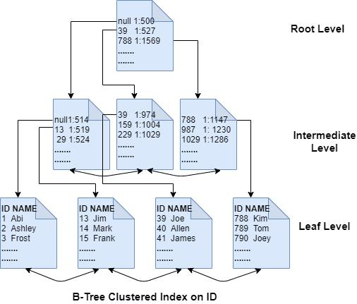
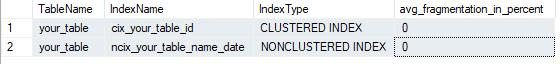
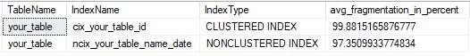
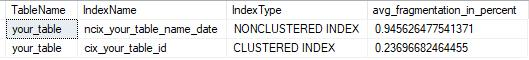
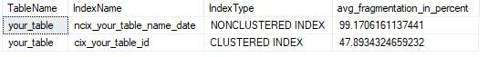
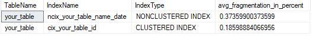

# A Guide to Indexing in SQL Server  
This chapter aims to simplify the topic of indexes in SQL Server, explaining fundamental concepts and offering practical maintenance tips.  

My commitment is to provide easy and quick reading, simplifying understanding of this important aspect in database and query management.  

## Index Overview  
A SQL Server index's main purpose is to accelerate data search processes in queries, enabling faster and more efficient data retrieval.  
- When an index is created, a disk structure is created to optimize data location in your table or view.  

The index stores table keys (fields) in a structure known as B-Tree. This structure allows SQL Server to locate the row or field associated with the index more effectively. When creating an index, you're creating a sort of data map that facilitates data navigation, resulting in faster queries.  

**B-Tree example in the image below:**  
-   

Remember: efficient queries consume fewer computational resources like CPU and memory.  

In Cloud environments, fewer operational resources mean what? Money!  

If your query demands too many operational resources in Cloud, this can lead to unexpectedly high charges - that's why index maintenance and creation can help.  

***But... Which index to create?***  

## Index Types in SQL Server  
SQL Server offers many index types available for creation. This article will cover:  
- Clustered  
- Nonclustered  
- Columnstore vs Rowstore  

## Clustered Indexes  
Clustered indexes (CLUSTERED INDEX) follow insertion order - they determine the physical data order in the table. They create an ordered structure (DESC or ASC) to facilitate B-Tree searches. New data is inserted maintaining the sequence defined by the index, whether ascending (ASC) or descending (DESC).  
- Imagine a book and its pages - same concept. When you set DESC it becomes a manga... lol  

**Key Points:**  
- Each table can have only one clustered index  
- When we create a Primary Key in a table, a clustered index is created  
- Columns in the clustered index are organized in the order specified during index creation  
- Cannot use INCLUDE to add more fields  

**Syntax Example:**  
```sql  
CREATE CLUSTERED INDEX cix_your_table_id  
ON your_table(id);  
```  

## Nonclustered Indexes  
Here's where the magic happens - nonclustered indexes (NONCLUSTERED INDEX) point directly to the information. Each row will have the nonclustered key value and a locator to the row.  
- A good example is a book index - the index tells you exactly where to find the information you want  

**Key Points:**  
- Multiple nonclustered indexes can exist per table  
- A nonclustered index doesn't affect the physical data order in the table  
- Each nonclustered index contains a list of pointers to corresponding data rows  
- Can add INCLUDE with other fields or multiple fields in the same index  

**Syntax Example:**  
```sql  
CREATE NONCLUSTERED INDEX ncix_your_table_date  
ON your_table(date ASC);  

CREATE NONCLUSTERED INDEX ncix_your_table_date  
ON your_table(date DESC);  
```  

**Syntax Example with Multiple Columns:**  
```sql  
CREATE NONCLUSTERED INDEX ncix_your_table_name_date  
ON your_table(name, date);  
```  

- If your query uses `[name]` and `[date]` in `WHERE` or `ORDER BY`, adding these fields can increase query efficiency and performance  

- If queries only need columns `[name]` and `[date]`, this index can serve those queries without accessing the main table  

**Syntax Example with INCLUDE:**  
```sql  
CREATE NONCLUSTERED INDEX ncix_your_table_name_include  
ON your_table(name)  
INCLUDE (phone);  
```  
- Instead of creating an index per column, you can use `INCLUDE` if fields are in `SELECT`  
- Since columns `[name]` and `[phone]` are in the index, queries can be served directly from the index, avoiding unnecessary main table access  
- If frequent queries require combining `[name]` with `[phone]`, this index can optimize these queries' performance  

## Columnstore vs Rowstore Indexes  
In short, ROWSTORE indexes are those mentioned above - recommended for transactional systems with many CRUD operations. COLUMNSTORE is better for large data loads, like a DW.  

With COLUMNSTORE indexes, data is compressed and stored by columns. They're logically organized like a standard row-and-column table, but physically stored in a column-oriented format with pointers to columns rather than rows.  
- Their structure points directly to the column itself, unlike ROWSTORE which points to rows  

**Key Points:**  
- Each table accepts only one COLUMNSTORE index  
- Each column is stored and managed independently  
- Designed for analytical queries and aggregations on large data volumes (DW, OLAP, etc.)  
- Highly recommended for tables and queries using many aggregate functions (`SUM`, `AVG`, `MIN`, `MAX`)  
- Columnstore compresses data - similar values in a column are stored efficiently, reducing required disk space  

**CLUSTERED Syntax Example:**  
```sql  
CREATE CLUSTERED COLUMNSTORE INDEX cix_your_table_id ON your_table  
WITH (DROP_EXISTING = ON);  
```  
- This example uses `WITH (DROP_EXISTING = ON);` to request removal of the CLUSTERED index and create this COLUMNSTORE instead  

**NONCLUSTERED Syntax Example:**  
```sql  
CREATE NONCLUSTERED COLUMNSTORE INDEX ncix_your_table_name_date  
ON your_table(name, date);  
```  
- Can use `WITH (DROP_EXISTING = ON)` if needed  

For our examples, this is the database model we'll use:  
```sql  
CREATE DATABASE [your_db]  

USE [your_db]  
GO  

CREATE TABLE [your_table]  
(  
    [id] [int] IDENTITY(1,1) NOT NULL,  
    [date] [datetime] NOT NULL,  
    [name] [varchar](50) NOT NULL,  
    [phone] [nvarchar](14) NULL  
)  

CREATE CLUSTERED INDEX cix_your_table_id  
ON your_table(id DESC);  

CREATE NONCLUSTERED INDEX ncix_your_table_name_date  
ON your_table(name DESC, date DESC);  
```  

## Index Fragmentation  
Index maintenance begins by understanding its fragmentation level. When we create an index, its fragmentation starts at 0%, but over time fragmentation increases, causing performance losses.  

CRUD operations cause fragmentation, with INSERT being the main villain.  

To check fragmentation level, use this query:  
```sql  
SELECT  
    OBJECT_NAME(B.object_id) AS TableName,  
    B.name AS IndexName,  
    A.index_type_desc AS IndexType,  
    A.avg_fragmentation_in_percent  
FROM  
    sys.dm_db_index_physical_stats(DB_ID(), NULL, NULL, NULL, 'LIMITED') A  
    INNER JOIN sys.indexes B WITH(NOLOCK) ON B.object_id = A.object_id AND B.index_id = A.index_id  
WHERE  
    OBJECT_NAME(B.object_id) NOT LIKE '[_]%'  
    AND A.index_type_desc != 'HEAP'  
ORDER BY  
    A.avg_fragmentation_in_percent DESC  
```  

This is my result (no operations yet):  
-   

Let's insert 100,000 rows:  
```sql  
-- Set desired row count  
DECLARE @RowCount INT = 100000;  
-- Control variables  
DECLARE @Counter INT = 1;  
-- Start insertion loop  
WHILE @Counter <= @RowCount  
BEGIN  
    -- Insert row with random data  
    INSERT INTO [your_table] ([date], [name], [phone])  
    VALUES  
    (  
        DATEADD(DAY, -ABS(CHECKSUM(NEWID())) % 365, GETDATE()), -- Random date in last 365 days  
        'Name' + CAST(@Counter AS VARCHAR(5)), -- Unique fake name  
        '(' + CAST(ABS(CHECKSUM(NEWID())) % 9000000000 + 1000000000 AS VARCHAR(14)) + ')' -- Random phone number  
    );  
    -- Increment counter  
    SET @Counter = @Counter + 1;  
END;  
```  

Check the fragmentation now:  
-   

### Internal vs External Fragmentation  
Fragmentation can be both internal and external - these types refer to data distribution in your storage structure.  
- High fragmentation = Disorganized index  
- Disorganized index = Slow queries  
- Slow queries = Operational resources  
- Operational resources = $$$  

**Internal Fragmentation:**  
- Occurs when there's unused space within a storage page  
- Results from fixed-block space allocation, leading to unused space when a block isn't completely filled  
- Can cause space waste and increased physical data size  
- **Example:** In a file system allocating 4KB blocks, if a file uses 2.5KB, there's 1.5KB of unused internal fragmentation  

**External Fragmentation:**  
- Occurs when available storage space is distributed in scattered blocks rather than contiguously  
- Results from data insertions, deletions or updates leaving scattered gaps  
- Can make new data allocation inefficient even with sufficient total free space  
- **Example:** In a database table, if multiple records are deleted creating gaps, this causes external fragmentation  

### REBUILD vs REORGANIZE  
This is where maintenance happens - REBUILD and REORGANIZE are index maintenance operations in relational databases. These operations aim to optimize index performance and efficiency.  

**REBUILD:**  

- **When to Use?**  
    - After internal/external fragmentation reaches critical levels (Can be used in above example)  
    - After major maintenance operations like bulk data loading  
    - When changing index structure (adding/removing columns)  

- **Impact?**  
    - Completely removes fragmentation  
    - Recreates the index, resulting in a new physical index  
    - May require more resources (CPU, disk space) and lock index operations during process (Run during off-peak hours)  

- **Example:**  
```sql  
ALTER INDEX cix_your_table_id ON [your_table] REBUILD; -- CLUSTERED  

ALTER INDEX ncix_your_table_name_date ON [your_table] REBUILD; -- NONCLUSTERED  
```  

**REORGANIZE:**  
- **When to Use?**  
    - For light to moderate fragmentation  
    - Can run after some ETL jobs involving bulk loading  
    - Less invasive than REBUILD, appropriate for keeping index in "good" condition  

- **Impact?**  
    - Reorganizes index pages but doesn't completely recreate the index  
    - Generally more resource-efficient and allows index to remain available for queries during operation  

- **Example:**  
```sql  
ALTER INDEX cix_your_table_id ON [your_table] REORGANIZE; -- CLUSTERED  

ALTER INDEX ncix_your_table_name_date ON [your_table] REORGANIZE; -- NONCLUSTERED  
```  

Let's first test REORGANIZE and see the impact:  
-   

Not bad, right? ;)  

In many cases it won't reduce as much as in my example. However, REORGANIZE is the best choice for scheduled maintenance. REBUILD can lock your database depending on table and database size.  

Now let's test REBUILD:  

Before testing, I'll insert the rows again:  
-   

And run REBUILD:  
-   

Reduced more than REORGANIZE, noticed?  

**The moral of the story is:** Schedule regular index maintenance to avoid performance issues.