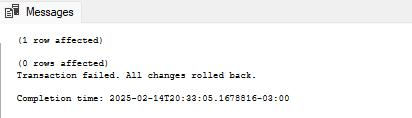
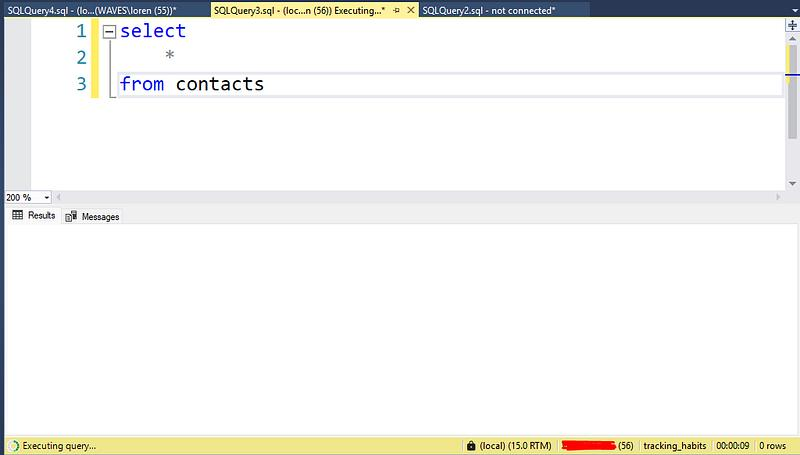
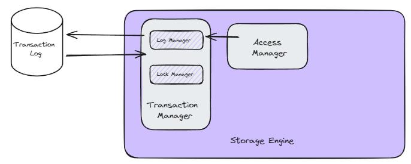

# A Guide to Transactions with COMMIT and ROLLBACK

If you’ve ever worked with a relational database, you know what a transaction is and how important it is in the database.

So, you know that when working with this type of database, it is essential to ensure data consistency and integrity. Nice words, right?

SQL provides **transactions** to handle operations that involve multiple queries. Transactions allow us to commit changes when everything goes well or roll them back in case of errors.

This article explores **DTL statements** using a database schema we created [in this article about data modeling.](https://lorenzouriel.github.io/posts/data-modelling/)

## Understanding Transactions
Have you ever heard of **ACID**? [It all comes down to transactions.](https://www.youtube.com/watch?v=RvPflBqV0OM)

A transaction is a sequence of SQL statements executed as a single unit of work. It follows the ACID properties:
- **Atomicity:** Ensures that all operations within a transaction are successfully completed. If one fails, the entire transaction is rolled back.
- **Consistency:** Ensures data integrity before and after the transaction.
- **Isolation:** Prevents transactions from interfering with each other.
- **Durability:** Ensures that once committed, the transaction remains in the database.

### Transaction Commands in SQL
- **BEGIN TRANSACTION:** Marks the beginning of a transaction.
- **COMMIT:** Saves all changes made in the transaction.
- **ROLLBACK:** Undoes all changes if an error occurs.

## Working with Transactions

### The COMMIT
Let's insert a new contact along with related goals and habits.

```sql
BEGIN TRANSACTION;

-- Insert new contact
INSERT INTO [contacts] ([name], [surname], [email], [phone_number])
VALUES ('Lorenzo', 'Uriel', 'lorenzouriel@gmail.com', '1234567890');

-- Insert a goal for the contact
INSERT INTO [goals] ([name], [description], [contact_id], [start], [end])
VALUES ('Read 10 Books', 'Complete reading 10 books this year', 2, '2025-01-01', '2025-12-31');

-- Insert a habit for the contact
INSERT INTO [habits] ([name], [description], [contact_id], [per_week], [per_month], [per_year])
VALUES ('Daily Exercise', 'Exercise for at least 30 minutes', 2, 5, 20, 240);

COMMIT;
````

* If all `INSERT` statements are executed successfully, `COMMIT` will save and finalize the transaction.
* If any statement fails, we must ensure the use of `ROLLBACK` to maintain data integrity. This brings us to the example below.

### The ROLLBACK

Imagine we try to insert data but encounter an error.

```sql
BEGIN TRANSACTION;

BEGIN TRY

    -- Insert new contact
    INSERT INTO [contacts] ([name], [surname], [email], [phone_number])
    VALUES ('Lorenzo', 'Uriel', 'lorenzouriel@gmail.com', '1234567890');
   
    -- Intentional error: setting an incorrect contact_id (-1)
    INSERT INTO [goals] ([name], [description], [contact_id], [start], [end])
    VALUES ('Learn SQL', 'Master SQL in 6 months', -1, '2025-02-01', '2025-08-01');
    
    COMMIT; -- This will not be executed if an error occurs

END TRY
BEGIN CATCH

    -- Roll back the transaction in case of error
    ROLLBACK;
    PRINT 'Transaction failed. All changes rolled back.';

END CATCH;
```

In this example:

* The invalid `contact_id = -1` causes a foreign key constraint violation.
* The `BEGIN CATCH` block catches the error and executes `ROLLBACK`.
* This ensures that no partial data is saved.

This is what happens when you execute:

* 

Still don’t understand? Let’s take a closer look at this example!

### Analyzing the Example

#### 1. `BEGIN TRANSACTION`

```sql
BEGIN TRANSACTION;
```

This starts a new transaction and SQL Server marks this point in the transaction log.

#### 2. `BEGIN TRY` Block

```sql
BEGIN TRY

END TRY
```

This block ensures that errors are properly caught and handled. So, if everything executes successfully, the transaction will be committed. If an error occurs, control is transferred to the `CATCH` block.

#### 3. Inserts (with intentional error)

```sql
INSERT INTO [contacts] ([name], [surname], [email], [phone_number])
VALUES ('Lorenzo', 'Uriel', 'lorenzouriel@gmail.com', '1234567890');

INSERT INTO [goals] ([name], [description], [contact_id], [start], [end])
VALUES ('Learn SQL', 'Master SQL in 6 months', -1, '2025-02-01', '2025-08-01');
```

All these operations are not immediately committed but remain in the transaction log.
The insert line fails because `-1` is an invalid `contact_id`. Due to the foreign key constraint on `contact_id`, SQL Server generates an error.

#### 4. `COMMIT`

```sql
COMMIT;
```

This line is never executed because the error in the previous step transfers control to the CATCH block.

#### 5. `BEGIN CATCH` Block

```sql
BEGIN CATCH
  PRINT 'Transaction failed. All changes rolled back.';
END CATCH;
```

Here we can handle the error by adding `PRINT` messages and the `ROLLBACK` statement. SQL Server does not commit any changes made in the `TRY` block.

#### 6. `ROLLBACK` Transaction

```sql
ROLLBACK;
```

Undoes all changes made within the transaction. Since SQL Server follows the **Write-Ahead Logging (WAL)** algorithm, it can revert the database to its previous state using the transaction log.

> [SQL Server uses a Write-Ahead Logging (WAL) algorithm, which ensures that no data modification is written to disk before the associated log record is written to disk. This maintains the ACID properties for a transaction.](https://medium.com/r?url=https%3A%2F%2Flearn.microsoft.com%2Fen-us%2Fsql%2Frelational-databases%2Fsql-server-transaction-log-architecture-and-management-guide%3Fview%3Dsql-server-ver16)

Since the beginning of the transaction, you cannot perform a `SELECT` on your table due to a lock generated by the start of the transaction:

* 

Until `COMMIT` or `ROLLBACK` occurs, the table will be inaccessible. That’s **ACID**!

Perfect! This is a good example of how it works and how it can save you in some situations.

But how does this work in the architecture layer?

### How Transactions Work in SQL Server Architecture

SQL Server manages transactions through the **[Transaction Manager](https://medium.com/@lorenzouriel/sql-tuning-sql-server-architecture-b39cf03fc8ac)**, which ensures the **ACID (Atomicity, Consistency, Isolation, Durability)** properties.

* 

Here’s how it works internally:

* SQL Server writes all changes to the transaction log (`LDF` file) before making modifications to the actual database (`MDF` file).
* If a transaction is committed (`COMMIT`), the changes are permanently written to disk.
* If a transaction fails, SQL Server uses the log to roll back the changes (via `ROLLBACK`), ensuring the database returns to its previous state.
* During the transaction, SQL Server applies locks on tables to prevent data inconsistencies. Isolation levels control how transactions interact with each other, ensuring they don’t interfere.
