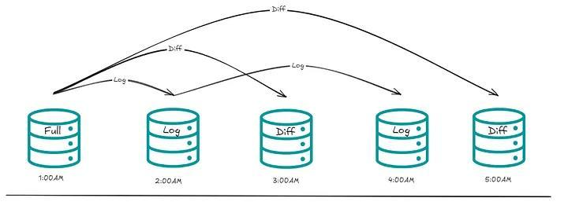

# A Guide to Backup and Restore  
The policy that should be discussed at work is Backup and Restore.  

It’s the kind of difficult conversation that needs to happen. It might not seem like a priority, but when the bomb explodes…  

I’ve been facing the challenge of structuring a backup policy for some systems.  

We always learn a lot from work challenges, and we learn even more when we teach others.  

The idea is to share exactly what you need to know before starting to discuss a Backup and Restore policy.  

I’ll talk about the types of backups and how to configure your database for these backup types.  

## Recovery Model  
In SQL Server, the Recovery Model is a critical database property that affects how transactions are logged, managed, and how the database can be recovered in case of failure.  

There are three main recovery models: Simple, Full, and Bulk-Logged.  

Each has its own characteristics and use cases for backup and restore strategies.  

### Simple Recovery Model:  
- **Backup:** In the Simple recovery model, only full database backups are allowed. Transaction log backups are not supported because the transaction log is automatically truncated (cleared) after each checkpoint.  

- **Restore:** With Simple recovery, you can only restore from the last full database backup. Point-in-time recovery is not possible because transaction log backups are not taken.  

Ideal for systems where data recovery to a specific point in time is not critical (e.g., development databases, systems with less critical data).  

**Example of setting the Simple recovery model:**  

```sql  
ALTER DATABASE your_db SET RECOVERY SIMPLE;  
```  

### Full Recovery Model:  
- **Backup:** In the Full recovery model, both full database backups and transaction log backups are supported. This allows for point-in-time recovery.  

- **Restore:** You can restore from the last full database backup or apply transaction log backups to recover to a specific point in time.  

Ideal for systems where data integrity and minimal data loss are critical, such as financial or transactional systems.  

**Example of setting the Full recovery model:**  

```sql  
ALTER DATABASE your_db SET RECOVERY FULL;  
```  

### Bulk-Logged Recovery Model:  
- **Backup:** Similar to the Full recovery model but provides more efficient logging for certain bulk operations, such as bulk inserts. However, point-in-time recovery is limited.  

- **Restore:** Similar to the Full recovery model, but there are restrictions on the types of operations that can be recovered using the transaction log.  

**Example of setting the Bulk-Logged recovery model:**  

```sql  
ALTER DATABASE your_db SET RECOVERY BULK_LOGGED;  
```  

In the Full and Bulk-Logged recovery models, ***regular transaction log backups are crucial to prevent the transaction log from growing indefinitely.***  

## Types of Backup  
### Full Backup:  
A full backup captures the entire database, including all data and schema objects. It’s good because it provides a complete copy of the database, simplifying the restore process.  

We need to be careful because full backups can be time-consuming and resource-intensive, especially for large databases.  

Typically used as a baseline backup and in combination with other backup types.  

**Example:**  

```sql  
BACKUP DATABASE your_db  
TO DISK = 'C:\Backup\FullBackup.bak'  
WITH INIT;  
```  

### Differential Backup:  
A differential backup captures only the changes made since the last full backup. It’s faster than a full backup and requires less storage space compared to full backups.  

The restore model involves the last full backup and the last differential backup, which may take longer than other models.  

Best for databases where changes occur regularly, but full backups are performed less frequently.  

**Example:**  

```sql  
BACKUP DATABASE your_db  
TO DISK = 'C:\Backup\DifferentialBackup.bak'  
WITH DIFFERENTIAL, INIT;  
```  

### Transaction Log Backup:  
Captures the changes made to the database since the last transaction log or full backup.  

Enables point-in-time recovery, minimizing data loss in case of failure.  

Requires careful management of transaction log backups to prevent log file growth—a good tip is to have more than one log backup per day.  

Critical for databases where minimal data loss is acceptable, such as financial or mission-critical systems.  

**Example:**  

```sql  
BACKUP LOG your_db  
TO DISK = 'C:\Backup\LogBackup.trn'  
WITH INIT;  
```  

***Here’s how it works:***  
1. Full backup at 1 AM.  
2. Transaction log backup at 2 AM (captures changes from 1 AM to 2 AM).  
3. Differential backup at 3 AM (captures all changes since 1 AM).  
4. Transaction log backup at 4 AM (captures changes from 2 AM to 4 AM).  

  

***Key Points:***  
- **Differential Backup:** Differential backups track changes since the last full backup, making them cumulative. Each differential backup is larger than the previous one, as it includes all changes since the last full backup.  
- **Transaction Log Backup:** Transaction log backups track changes incrementally since the last transaction log backup, allowing for precise point-in-time recovery and much smaller incremental backups.  

### Copy-Only Backup:  
A standalone backup that does not affect the normal backup sequence. It does not impact the differential backup chain or log backups.  

Useful for creating ad-hoc backups without disrupting the existing backup strategy. Does not participate in the restore sequence for differential or log backups.  

Useful for creating one-off backups for specific purposes without affecting the regular backup sequence.  

**Example:**  

```sql  
BACKUP DATABASE your_db  
TO DISK = 'C:\Backup\CopyOnlyBackup.bak'  
WITH COPY_ONLY, INIT;  
```  

### Snapshot Backup:  
A point-in-time copy of the entire database, captured without interrupting database operations.  

Suitable for creating copies for testing, reporting, or other non-production purposes, often used in replication and database migration.  

> Snapshot backups are typically performed at the storage level using storage system-specific commands. SQL Server itself does not directly support snapshot backups via Transact-SQL commands. Consult your storage system’s documentation for snapshot capabilities—Microsoft  

## NORECOVERY and RECOVERY  
In SQL Server, the NORECOVERY and RECOVERY options are used during the restore process, specifically in the context of restoring backups. These options determine the state of the database after a restore operation.  

### NORECOVERY:  
When you use the NORECOVERY option, it means you are restoring a backup but not bringing the database online immediately.  

This option is typically used when you have multiple backups to apply (such as full backups and subsequent transaction log backups) and want to apply them sequentially before making the database available to users.  

This option leaves the database in a "restoring" state, allowing additional restores to be applied.  

**Example:**  

```sql  
-- Restore a full backup with NORECOVERY  
RESTORE DATABASE your_db FROM DISK = 'C:\Backup\FullBackup.bak' WITH NORECOVERY;  

-- Restore transaction log backups with NORECOVERY  
RESTORE LOG your_db FROM DISK = 'C:\Backup\LogBackup_1.trn' WITH NORECOVERY;  
RESTORE LOG your_db FROM DISK = 'C:\Backup\LogBackup_2.trn' WITH NORECOVERY;  

-- Finally, bring the database online  
RESTORE DATABASE your_db WITH RECOVERY;  
```  

### RECOVERY:  
When you use the RECOVERY option, it means you are bringing the database online after the restore operation. This is the final step in the restore process.  

After using RECOVERY, users can connect to the database, and it becomes operational.  

This option is typically used when you have applied all necessary backups and want the database to be available for normal operations.  

**Example:**  

```sql  
-- Restore a full backup with RECOVERY  
RESTORE DATABASE your_db FROM DISK = 'C:\Backup\FullBackup.bak' WITH RECOVERY;  
```  

In summary, the sequence generally involves using NORECOVERY for intermediate restores (full backup and subsequent log backups) and then using RECOVERY for the final restore to make the database available. This is a common approach when performing point-in-time recovery or applying a chain of backups to restore a database to a specific state.  

#### Tip: Use DBCC CHECKDB  
After restoring, run DBCC CHECKDB to verify database integrity.  

**Example:**  

```sql  
USE your_db;  
DBCC CHECKDB ([your_db]);  
```  

If **DBCC CHECKDB** reports errors, assess the severity and take appropriate action. Options may include restoring from a different backup, manually fixing specific issues, or seeking assistance from Microsoft support.  

This is what you need to know to start thinking about a complete Backup & Restore solution!