# A Guide to Backup - Creating an Automated Routine  
This chapter aims to present the architecture for implementing an "Automated Backup Routine".  

### The Maintenance Solution  
*Even though this is an introductory topic for the chapter - this is where the gold is (I'm being honest)*  

This solution was created by [Ola Hallengren](https://ola.hallengren.com/). The guy simply wrote a query designed to automate all possible maintenance routines:  
- `MaintenanceSolution.sql`  

The solution was made to handle those tedious tasks we DBAs do daily, you know?  

We can say it covers:  
- Database Backup (DatabaseBackup)  
- Index Optimization (IndexOptimize)  
- Database Integrity Verification (DatabaseIntegrityCheck)  

What do you need to do? Download the solution script and run it on your SQL Server.  

I won't include the script code here because it contains 9,104 lines, but you can download it here: [https://ola.hallengren.com/scripts/MaintenanceSolution.sql](https://ola.hallengren.com/scripts/MaintenanceSolution.sql)  
- 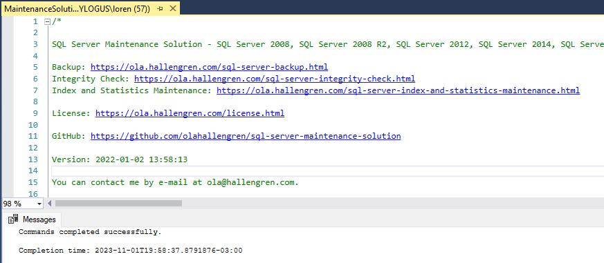  

After running it, you can explore the solutions to start implementation in your database. Here are links to each one:  
- [DatabaseBackup: SQL Server Backup](https://ola.hallengren.com/sql-server-backup.html)  
- [DatabaseIntegrityCheck: SQL Server Integrity Check](https://ola.hallengren.com/sql-server-integrity-check.html)  
- [IndexOptimize: SQL Server Index and Statistics Maintenance](https://ola.hallengren.com/sql-server-index-and-statistics-maintenance.html)  

### A Query for Each Backup Type  
First of all, do you know what types of backups exist?  

Well, we have FULL, DIFF, and LOG - these are the main ones.  

In a brief explanation of each:  
- **FULL** - A complete copy of all database data at the moment the backup is executed.  
- **DIFF** - Captures only changes made to the database since the last FULL backup.  
- **LOG** - Captures all transactions that occurred in the database since the last LOG backup. (Useful for point-in-time recovery.)  

Now that we understand backups, let's look at the solution queries. The initial solution provides countless parameters you can add to the query.  

I'll use the most important ones (for this solution) in the article.  

I'll add the queries for each backup type with a brief explanation of each parameter:  

**FULL**  
```sql
-- Start of the week  
EXECUTE dbo.DatabaseBackup  
@Databases = 'your_db', -- Your Database (USER_DATABASES backs up all)  
@Directory = 'C:\Backup', -- Directory where you want to save  
@BackupType = 'FULL', -- Backup Type (FULL/DIFF/LOG)  
@Compress = 'Y', -- Performs compression (Reduces file size)  
@CheckSum = 'Y', -- Verifies everything went well (Nothing was corrupted)  
@CleanupMode = 'BEFORE_BACKUP' -- Deletes old backups to avoid filling storage  
```  

**DIFF**  
```sql
-- End of each day  
EXECUTE dbo.DatabaseBackup  
@Databases = 'your_db', -- Your Database (USER_DATABASES backs up all)  
@Directory = 'C:\Backup', -- Directory where you want to save  
@BackupType = 'DIFF', -- Backup Type (FULL/DIFF/LOG)  
@ChangeBackupType = 'Y', -- If it fails, change the backup type (Safety measure)  
@CleanupMode = 'BEFORE_BACKUP' -- Deletes old backups to avoid filling storage  
```  

**LOG**  
```sql
-- Every hour  
EXECUTE dbo.DatabaseBackup  
@Databases = 'your_db', -- Your Database (USER_DATABASES backs up all)  
@Directory = 'C:\Backup', -- Directory where you want to save  
@BackupType = 'LOG', -- Backup Type (FULL/DIFF/LOG)  
@LogSizeSinceLastLogBackup = 1024, -- Specify a minimum size (MB) for log generated since last log backup  
@CleanupMode = 'BEFORE_BACKUP' -- Deletes old backups to avoid filling storage  
```  

I've added the queries in a "simple" way, as this is just an example. However, this solution covers MUCH more complex models, such as:  
- **@URL** - You can add an Azure Blob Storage URL  
- **@MirrorDirectory** - Want to add multiple repositories?  
- **@Encrypt** - Need encryption? We've got it!  
- **@AvailabilityGroupFileName** - Want to customize the filename? That's possible too  

And that's just the beginning—there are countless parameters! And remember, there are two more solutions besides this one—we're only talking about Backup here.  

## The Policy Chosen for Our Solution  
I'll adapt this to the reality of a database that's updated intensively, not necessarily in batch processing.  

Batch processing is a data processing approach where large volumes of information are processed in a single run, rather than in real-time or interactively.  
- For batch processing, I recommend using the same logic below, but only with FULL and DIFF backups.  

Let's begin—this is called a Backup Policy!  

The DBA can create a Backup Policy by combining FULL, DIFF, and LOG backups—and who's the DBA? You, my friend!  

The chosen policy is:  
- Start of the week (Sunday) - FULL  
- End of each day (except Sunday) - DIFF  
- Every hour - LOG  

The cycle ends, and we perform a new FULL backup.  

## Automating Everything in SQL Server Agent  
Now that you have the queries, the policy, and the logic, just add everything to SQL Agent and schedule it.  

Let's do an example together?  

1. Create a new Job and standardize the names. I like to use the database name + backup type. It would look like this: `your_db_FULL`  
- 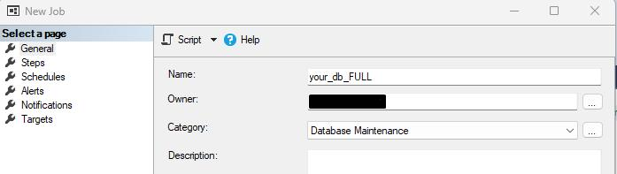  

2. Go to the Steps tab and click New. Copy and paste the Query, and make sure the selected database is `master`.  
- 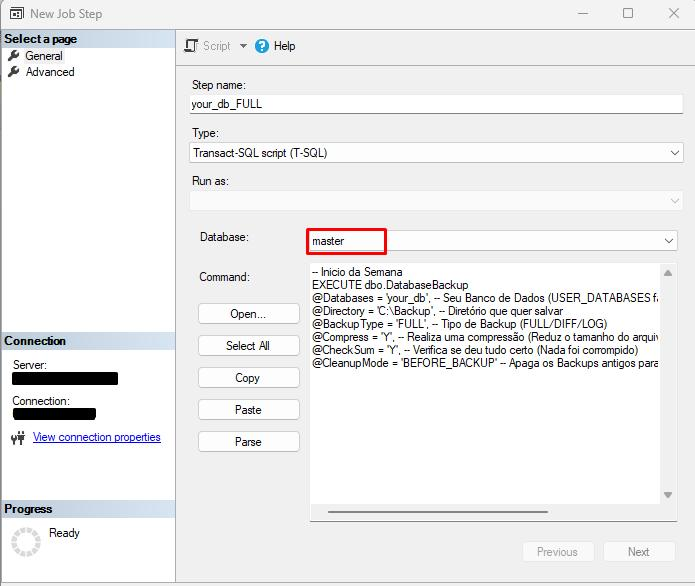  

3. Go to the Schedules tab and click New. This is where we'll schedule the Agent to run our Query on Sundays. Follow the example below:  
- 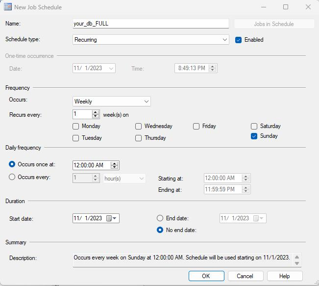  

Repeat the same steps for the other Queries. To help you, I'll add how each schedule looks below.  

**DIFF Schedule**  
The DIFF backup needs to run every day except Sunday. Sunday is already taken!  
- 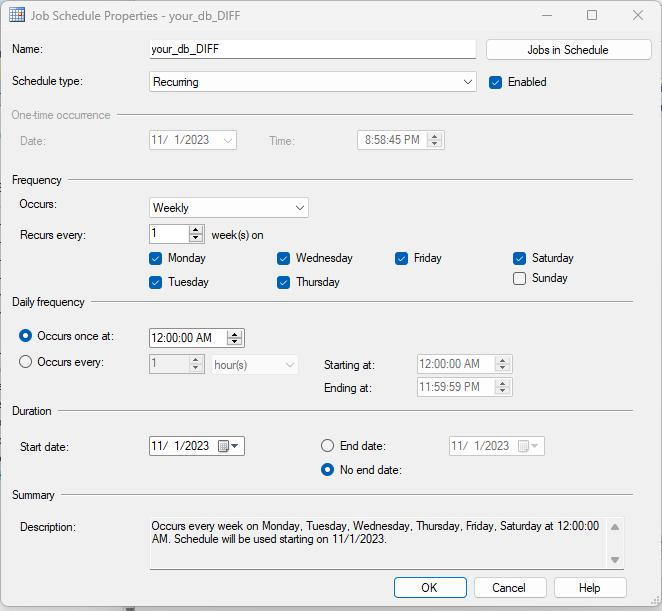  

**LOG Schedule**  
Notice that here I set the start time after 1 AM and the end time at 11 PM. This way, it won't interfere with other backups.  
- 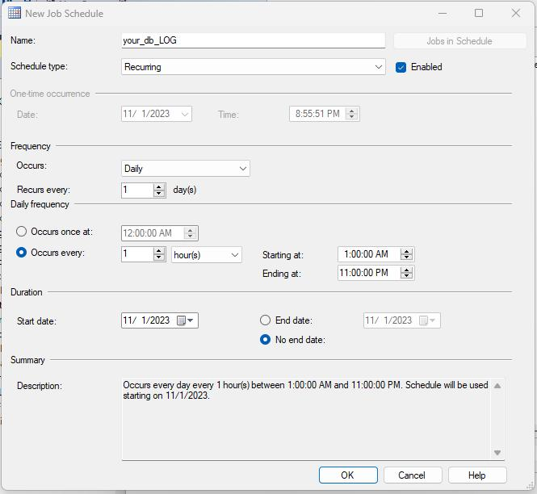  

You'll find them like this in the folder:  
- 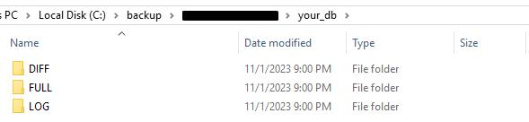  

Now just let it run and breathe easy—if a DELETE without a WHERE clause happens to your database, you'll have somewhere to turn!  

## Sending Backups to Blob Storage  
Earlier in this article, I introduced the idea of sending your backups to Azure Blob Storage. In this section, I'll guide you through the steps to achieve this.  

You can think of this as a continuation of my previous article, where I explained how to automatically create a backup routine using SQL Server and SQL Agent. You can [read it here](https://medium.com/@lorenzouriel/automated-backup-routine-464217ae4f4a).  

## Step 1: Set Up a Blob Storage Account  
The first step is to create a Blob Storage account in Azure. This will serve as the destination for your database backups.  

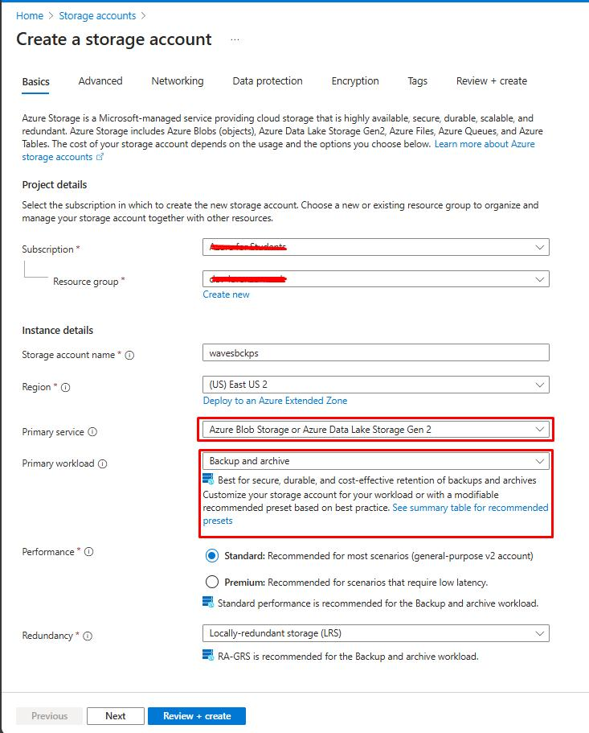  

#### Create Containers for Backups  
For better organization, create separate containers for each backup type (Full, Diff, and Log). This will make it easier to manage your backups.  

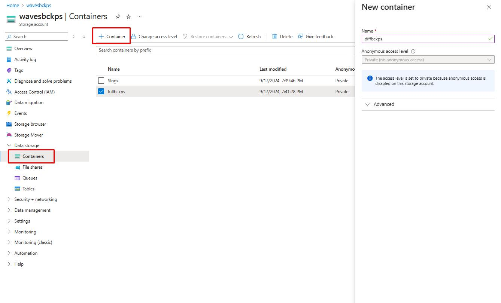  

#### Generate a SAS Token  
To securely upload your backups to Azure, you'll need a SAS (Shared Access Signature) token with read and write permissions. This token allows you to safely transfer your backup files to Blob Storage.  

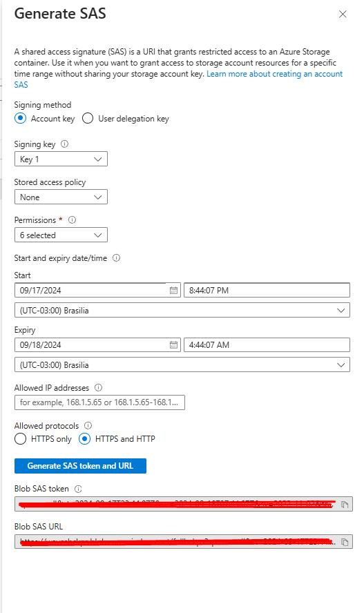  

## Step 2: Upload Backups to Blob Using `AzCopy`  
#### Install `AzCopy`  
`AzCopy` is a command-line utility designed to simplify data transfers to and from Azure Blob Storage. Follow the official installation guide for your operating system:  

- You can install it here: [https://learn.microsoft.com/en-us/azure/storage/common/storage-use-azcopy-v10?tabs=dnf](https://learn.microsoft.com/en-us/azure/storage/common/storage-use-azcopy-v10?tabs=dnf)  

#### Verify Installation  
After installation, navigate to the `AzCopy` installation directory and verify the installation by running:  

```bash
cd "C:\Program Files\azcopy"  
azcopy --version  
```  
- ***Tip:** Add the folder path to your environment variables.*  

#### Upload Backups to Blob Storage  
After creating the backup, you can use `AzCopy` to upload it to your Blob Storage container. Run the following command, replacing the file path and SAS URL with your own parameters:  

```bash
azcopy copy "C:\Backup\MyBackupExample.bak" "https://your.blob.core.windows.net/fullbckps?sp=rw...."  
```  

The output will be:  

```bash
INFO: Scanning...  
INFO: Any empty folders will not be processed, because source and/or destination doesn't have full folder support  

Job 701d8ab4-57fd-4e4d-523b-dcd0cc1ae89a has started  
Log file is located at: C:\Users\.azcopy\701d8ab4-57fd-4e4d-523b-dcd0cc1ae89a.log  

100.0 %, 1 Done, 0 Failed, 0 Pending, 0 Skipped, 1 Total, 2-sec Throughput (Mb/s): 1.2826  

Job 701d8ab4-57fd-4e4d-523b-dcd0cc1ae89a summary  
Elapsed Time (Minutes): 0.1003  
Number of File Transfers: 1  
Number of Folder Property Transfers: 0  
Number of Symlink Transfers: 0  
Total Number of Transfers: 1  
Number of File Transfers Completed: 1  
Number of Folder Transfers Completed: 0  
Number of File Transfers Failed: 0  
Number of Folder Transfers Failed: 0  
Number of File Transfers Skipped: 0  
Number of Folder Transfers Skipped: 0  
Total Number of Bytes Transferred: 1238528  
Final Job Status: Completed  
```  

After this, you can check your Azure Blob Storage:  
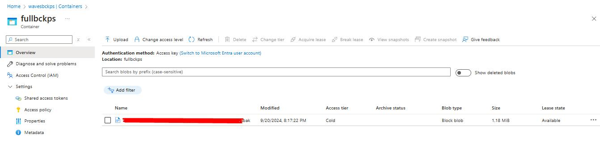  

You can integrate this command directly into your database backup scripts to automate the transfer process to Azure.  

## Step 3: Run AzCopy in a SQL Server Job  
You can create a SQL Server Agent job that runs a PowerShell script, which in turn executes the `AzCopy` command.  

#### 1. Create a PowerShell Script to Run the `AzCopy` Command:  

```bash
# AzCopy PowerShell script (save as azcopy.ps1)  
$source = "C:\Backup\MyBackupExample.bak"  
$destination = "https://your.blob.core.windows.net/fullbckps?sp=rw...."  
azcopy copy $source $destination  
```  

#### 2. Create a SQL Server Agent Job to Call the PowerShell Script.  

```bash
EXEC msdb.dbo.sp_add_job @job_name = 'AzCopy Job'  
EXEC msdb.dbo.sp_add_jobstep @job_name = 'AzCopy Job',   
    @step_name = 'Run AzCopy',   
    @subsystem = 'PowerShell',   
    @command = 'C:\path\to\azcopy.ps1'  
```  

Or you can simply configure it directly in SSMS:  
- 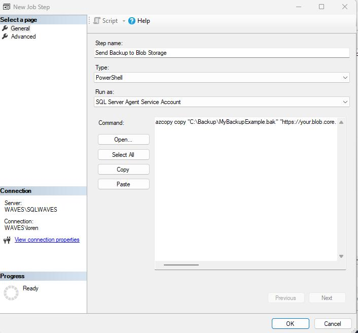  

You can enable `xp_cmdshell` and run the `AzCopy` command directly from SQL Server, though this is less secure and should be used with caution.  

```sql
EXEC sp_configure 'show advanced options', 1;  
RECONFIGURE;  
EXEC sp_configure 'xp_cmdshell', 1;  
RECONFIGURE;  
```  

Run the `AzCopy` command via `xp_cmdshell`:  
```sql
EXEC xp_cmdshell 'azcopy copy "C:\Backup\MyBackupExample.bak" "https://your.blob.core.windows.net/fullbckps?sp=rw...."';  
```  

This way, `AzCopy` can be part of your SQL Server backup workflows, as shown in the architecture below.  

- 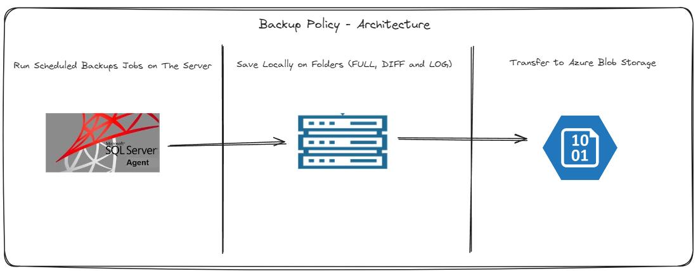  

I hope this chapter helps you create your first Backup and Restore policy!