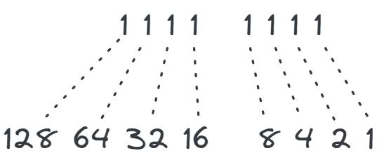
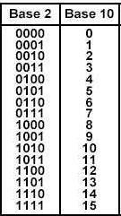

# A Guide to Bitmasking & Bitwise  

**Bitmasking** and **Bitwise** are concepts primarily used in programming to manipulate and represent data at the bit level, enabling efficient operations.  

**Bitmasking** refers to the process of using a bitmask to manipulate or check the value of specific bits in a binary number.  

This is done using **bitwise operators** like AND (`&`), OR (`|`), XOR (`^`), NOT (`~`), and others. Bitmasks are used to define which bits of a number will be modified, tested, or enabled.  

## What is it used for?  

- **Permissions and States:** Can be used to represent and manipulate permissions or states in a system. For example, in a permission system, each bit can represent an access level.  

- **Data Compression:** In some cases, multiple pieces of information can be compressed into a single field using bitmasking.  

- **Optimization:** Bitmasking can be more efficient in terms of time and space by saving fields in a table.  

## A Brief Overview of Bits, Bytes, and Bases  
The most basic level of representation in computing is a **bit**.  

A bit is a single value, either `0` or `1`. A **nibble** consists of four bits (`0000` or `1111`). A **byte** is made up of 8 bits (`0000 0000` or `1111 1111`).  

There’s also a **word**, which is 16 bits (`0000 0000 0000 0000` or `1111 1111 1111 1111`).  

**What does this mean?**  

If a bit has the value `1`, it is **on**, and if it’s `0`, it is **off**. So, in a byte, we have 8 possible values.  

**These values can represent:** fields, objects, validations, process cycles, and much more.  

The best part is that there’s no limit—you can enable as many bits as needed.  

To work with **bitwise operations**, we convert from **Base 2 (binary) to Base 10 (decimal)**.  

The easiest and most practical way to work with this is to **pre-map the bit values.**  

Below is an **example conversion table:**  

-   

## How to Use Bitwise in SQL?  
The first step is to define which values each bit represents.  

Let’s consider a fact table for an e-commerce system.  

**Order Lifecycle:**  
```  
   Attribute                      Value  
   --------------------------------------      
   Order Placed                    1     
   Payment Processing              2     
   Payment Identified              4  
   Fast Delivery                   8  
   Order Shipped                   16  
   Order Delivered                 32  
   Customer Feedback               64  
   Order Canceled                  128  
```  

Here are some examples of using **bitwise** to combine values:  
```sql
-- Order Placed  
SELECT 1 | 1;  -- (1)  

-- Payment Processing  
SELECT 1 | 2;  -- (3)  

-- Payment Identified  
SELECT 1 | 2 | 4;  -- (7)  

-- Has the order been shipped?  
SELECT 1 | 2 | 16;  -- (19)  

-- What about fast delivery?  
SELECT 1 | 2 | 8 | 16;  -- (27)  

-- Customer wants to remove fast delivery?  
SELECT 27 & ~8;  -- (19)  

-- Before removing, is the Fast Delivery option enabled?  
DECLARE @status INT = 27;  

-- Check if bit 8 is on (returns 1 if on, 0 if off)  
SELECT CASE WHEN (@status & 8) > 0 THEN 1 ELSE 0 END AS Bit8IsOn;  
```  

**What are we doing here?** Essentially, turning bits on and off.  

**Where do these numbers come from?** This table explains it better:  

-   

If you look at the **Payment Processing** option, we activate the first two bits (`0011`), which returns `3`.  

And this is what we call **Bitmasking** with **Bitwise** manipulation in SQL.