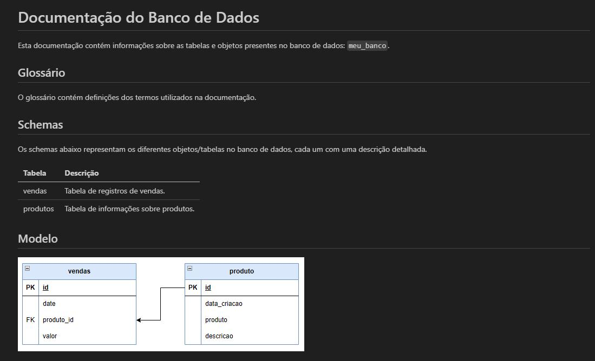
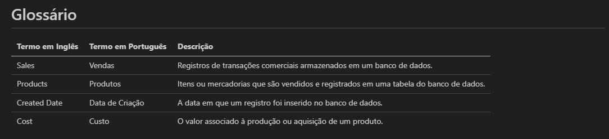
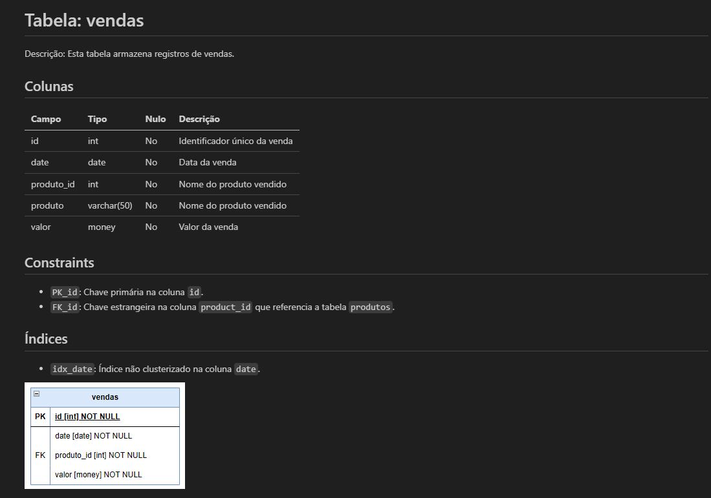
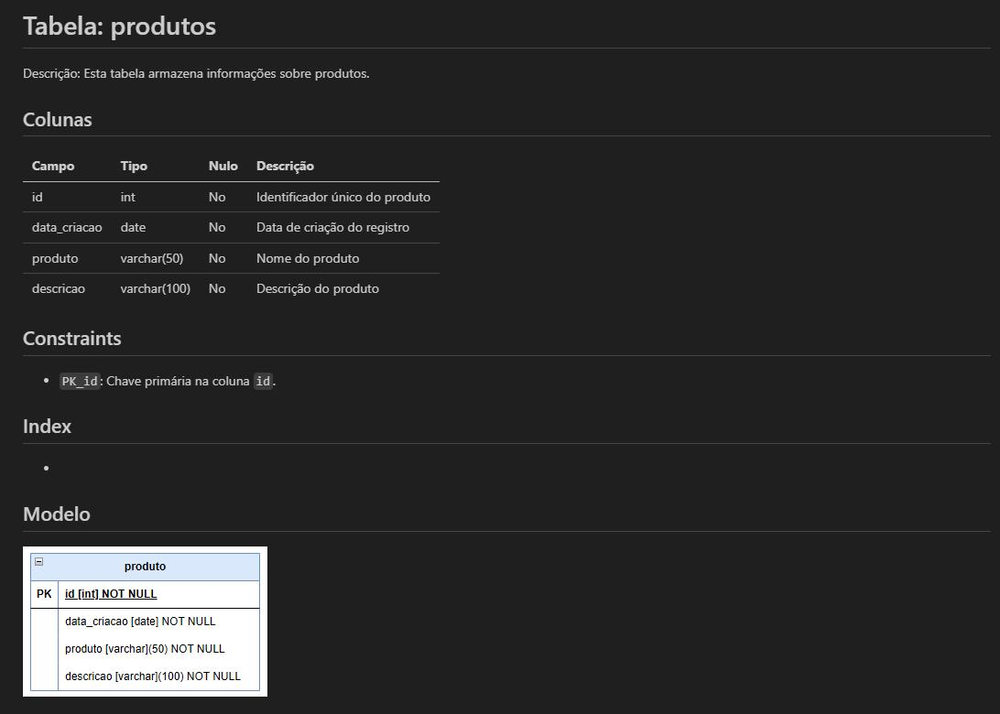

# A Guide to Data Dictionary  
A data dictionary is a collection of descriptions about the data, objects, and tables used in a DBMS. It is essentially a complete documentation of your database. In this dictionary, you specify everything that complements your tables.  

Imagine a scenario where you are given access to a database. Without a dictionary, you will need to open table by table to understand what it stores, data types, field types, and relationships. With a data dictionary, the story is different: everything is already described in the documentation.  

**Summary of the story:** When you receive access to the database, ask if a data dictionary is available.  

The idea of this chapter is to provide ideas and templates that I use and that I see the community using.  

**How I would structure database documentation:**  
```
---> Documentation  
  ------> Glossary  
  -------> Schemas  
        ----------> Table 01  
          Description: This table stores customer information.  
          Columns:  
            - customer_id (int, PK): Unique identifier for the customer.  
            - name (varchar): Customer's name.  
            - address (varchar): Customer's address.  
          Constraints:  
            - PK_customer_id: Primary key on the customer_id column.  
            - UQ_name: Uniqueness constraint on the name column.  
          Indexes:  
            - idx_customer_name: Non-clustered index on the name column.  
          Physical Model Image: [Insert image of the table structure]  

        ----------> Table 02  
          Description: This table contains order records.  
          Columns:  
            - order_id (int, PK): Unique identifier for the order.  
            - customer_id (int, FK): Foreign key referencing customer_id in Table 01.  
            - order_date (datetime): Date the order was placed.  
            - total_value (decimal): Total value of the order.  
          Constraints:  
            - PK_order_id: Primary key on the order_id column.  
            - FK_customer_id: Foreign key referencing customer_id in Table 01.  
          Indexes:  
            - idx_order_date: Non-clustered index on the order_date column.  
          Physical Model Image: [Insert image of the table structure]  
```  

**In this structure:**  
- **Documentation:** Add a main README.md with an explanation of the folders (Glossary and Schemas) and a table summarizing all tables in the database.  
- **Glossary:** Add information about the terms used in the documentation and the project as a whole.  
- **Schemas:** Add all different objects/tables in the database in markdown format and an image of the table (svg, jpg, png, etc.).  
    - **Table 01 and Table 02:** Examples of tables in the database, each with its description, columns, constraints, and associated indexes. Here you view the image that was added.  

## README.md (Main Documentation):  
```
# Database Documentation  

This documentation contains information about the tables and objects in the database: `my_database`.  

## Glossary  

The glossary contains definitions of the terms used in the documentation.  

## Schemas  

The schemas below represent the different objects/tables in the database, each with a detailed description.  

| Table       | Description                                      |  
|-------------|------------------------------------------------|  
| sales       | Table of sales records.                         |  
| products    | Table of product information.                   |  

## Model  
  
---  
```  
**README.md Preview:**  
-   

## Glossary.md (Glossary):  
```
# Glossary  

| English Term       | Portuguese Term    | Description                                                                                   |  
|--------------------|--------------------|--------------------------------------------------------------------------------------------- |  
| Sales              | Vendas             | Records of commercial transactions stored in a database.                                      |  
| Products           | Produtos           | Items or goods that are sold and recorded in a database table.                               |  
| Created Date       | Data de Criação    | The date a record was inserted into the database.                                            |  
| Cost               | Custo              | The value associated with the production or acquisition of a product.                        |  
```  
**Glossary Preview:**  
-   

## sales.md (Schema for Sales Table):  
```
# Table: sales  

Description: This table stores sales records.  

## Columns  

| Field       | Type           | Null | Description                   |  
|-------------|----------------|------|-----------------------------|  
| id          | int            | No   | Unique identifier for the sale |  
| date        | date           | No   | Sale date                    |  
| product_id  | int            | No   | ID of the sold product       |  
| product     | varchar(50)    | No   | Name of the sold product     |  
| value       | money          | No   | Sale value                   |  

## Constraints  
- `PK_id`: Primary key on the `id` column.  
- `FK_id`: Primary key on the `id` column.  

## Indexes  
- `idx_date`: Non-clustered index on the `date` column.  

  
```  
**Sales Preview:**  
-   

## products.md (Schema for Products Table):  
```
# Table: products  

Description: This table stores product information.  

## Columns  

| Field         | Type           | Null | Description                       |  
|---------------|----------------|------|---------------------------------|  
| id            | int            | No   | Unique identifier for the product |  
| creation_date | date           | No   | Record creation date              |  
| product       | varchar(50)    | No   | Product name                      |  
| description   | varchar(100)   | No   | Product description               |  

## Constraints  
- `PK_id`: Primary key on the `id` column.  

## Index  
-  

## Model  
  
```  
**Products Preview:**  
- 